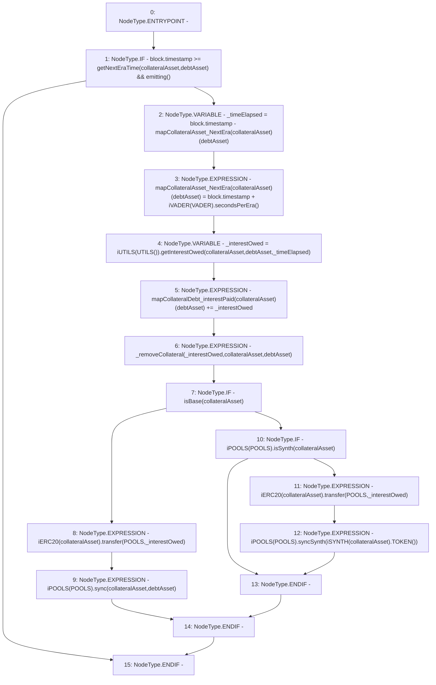

# Context: Router.payInterest

**Contract:** `Router` (Inherits: None)
**Signature:** `payInterest(address,address)`
**Method Selector ID:** `Internal (No Method ID)`
**Visibility:** `internal`
**Environment-Free:** `No (reads EVM state context)`
**Modifiers:** None

### State Variables Interaction
- **Reads:** POOLS, VADER, mapCollateralAsset_NextEra, mapCollateralDebt_interestPaid
- **Writes:** mapCollateralAsset_NextEra, mapCollateralDebt_interestPaid

### Environment & Verification Flags
- **Uses Foundry Cheatcodes:** No
- **Has Echidna Properties:** No

### Internal Calls Tree
- None

### External Calls / Value Transfers
- `iERC20.TMP_522(bool) = HIGH_LEVEL_CALL, dest:TMP_521(iERC20), function:transfer, arguments:['POOLS', '_interestOwed']  `
- `iVADER.TMP_508(uint256) = HIGH_LEVEL_CALL, dest:TMP_507(iVADER), function:secondsPerEra, arguments:[]  `
- `iPOOLS.HIGH_LEVEL_CALL, dest:TMP_517(iPOOLS), function:sync, arguments:['collateralAsset', 'debtAsset']  `
- `iPOOLS.TMP_520(bool) = HIGH_LEVEL_CALL, dest:TMP_519(iPOOLS), function:isSynth, arguments:['collateralAsset']  `
- `iERC20.TMP_516(bool) = HIGH_LEVEL_CALL, dest:TMP_515(iERC20), function:transfer, arguments:['POOLS', '_interestOwed']  `
- `iPOOLS.HIGH_LEVEL_CALL, dest:TMP_523(iPOOLS), function:syncSynth, arguments:['TMP_525']  `
- `iSYNTH.TMP_525(address) = HIGH_LEVEL_CALL, dest:TMP_524(iSYNTH), function:TOKEN, arguments:[]  `
- `iUTILS.TMP_512(uint256) = HIGH_LEVEL_CALL, dest:TMP_511(iUTILS), function:getInterestOwed, arguments:['collateralAsset', 'debtAsset', '_timeElapsed']  `

### Control Flow Graph (CFG)


### Source Mapping
Declared in: `contracts/Router.sol` on lines **358** to **373**

```solidity
    function payInterest(address collateralAsset, address debtAsset) internal {
        if (block.timestamp >= getNextEraTime(collateralAsset, debtAsset) && emitting()) {                              // If new Era
            uint _timeElapsed = block.timestamp - mapCollateralAsset_NextEra[collateralAsset][debtAsset];
            mapCollateralAsset_NextEra[collateralAsset][debtAsset] = block.timestamp + iVADER(VADER).secondsPerEra(); 
            uint _interestOwed = iUTILS(UTILS()).getInterestOwed(collateralAsset, debtAsset, _timeElapsed);
            mapCollateralDebt_interestPaid[collateralAsset][debtAsset] += _interestOwed;
            _removeCollateral(_interestOwed, collateralAsset, debtAsset);
            if(isBase(collateralAsset)){
                iERC20(collateralAsset).transfer(POOLS, _interestOwed);
                iPOOLS(POOLS).sync(collateralAsset, debtAsset);
            } else if(iPOOLS(POOLS).isSynth(collateralAsset)){
                iERC20(collateralAsset).transfer(POOLS, _interestOwed);
                iPOOLS(POOLS).syncSynth(iSYNTH(collateralAsset).TOKEN());
            }
        }
    }

```
