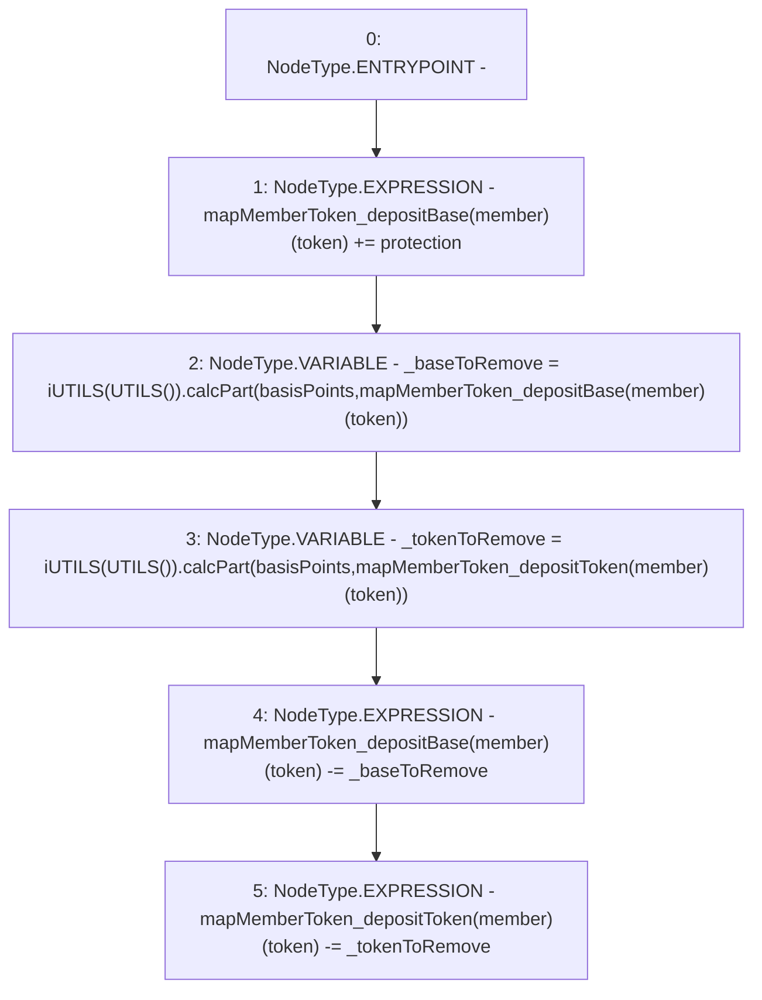

# Context: Router.removeDepositData

**Contract:** `Router` (Inherits: None)
**Signature:** `removeDepositData(address,address,uint256,uint256)`
**Method Selector ID:** `Internal (No Method ID)`
**Visibility:** `internal`
**Environment-Free:** `Yes`
**Modifiers:** None

### State Variables Interaction
- **Reads:** mapMemberToken_depositBase, mapMemberToken_depositToken
- **Writes:** mapMemberToken_depositBase, mapMemberToken_depositToken

### Environment & Verification Flags
- **Uses Foundry Cheatcodes:** No
- **Has Echidna Properties:** No

### Internal Calls Tree
- None

### External Calls / Value Transfers
- `iUTILS.TMP_365(uint256) = HIGH_LEVEL_CALL, dest:TMP_364(iUTILS), function:calcPart, arguments:['basisPoints', 'REF_203']  `
- `iUTILS.TMP_362(uint256) = HIGH_LEVEL_CALL, dest:TMP_361(iUTILS), function:calcPart, arguments:['basisPoints', 'REF_200']  `

### Control Flow Graph (CFG)


### Source Mapping
Declared in: `contracts/Router.sol` on lines **201** to **207**

```solidity
    function removeDepositData(address member, address token, uint basisPoints, uint protection) internal {
        mapMemberToken_depositBase[member][token] += protection;
        uint _baseToRemove = iUTILS(UTILS()).calcPart(basisPoints, mapMemberToken_depositBase[member][token]);
        uint _tokenToRemove = iUTILS(UTILS()).calcPart(basisPoints, mapMemberToken_depositToken[member][token]);
        mapMemberToken_depositBase[member][token] -= _baseToRemove;
        mapMemberToken_depositToken[member][token] -= _tokenToRemove;
    }

```
