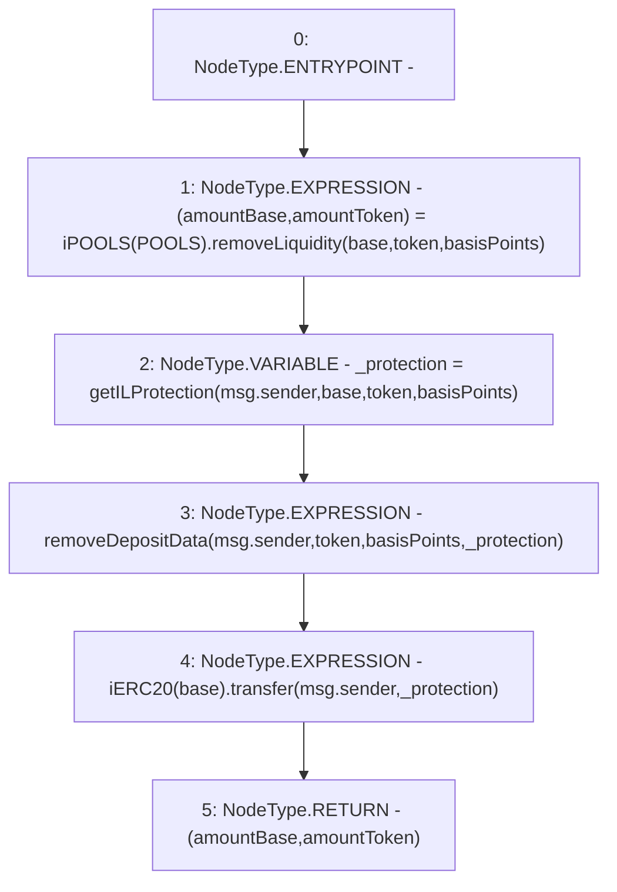

# Context: Router.removeLiquidity

**Contract:** `Router` (Inherits: None)
**Signature:** `removeLiquidity(address,address,uint256) returns (uint256, uint256)`
**Method Selector ID:** `0xd752fab2`
**Visibility:** `external`
**Environment-Free:** `No (reads EVM state context)`
**Modifiers:** None

### State Variables Interaction
- **Reads:** POOLS
- **Writes:** None

### Environment & Verification Flags
- **Uses Foundry Cheatcodes:** No
- **Has Echidna Properties:** No

### Internal Calls Tree
- None

### External Calls / Value Transfers
- `iPOOLS.TUPLE_2(uint256,uint256) = HIGH_LEVEL_CALL, dest:TMP_273(iPOOLS), function:removeLiquidity, arguments:['base', 'token', 'basisPoints']  `
- `iERC20.TMP_277(bool) = HIGH_LEVEL_CALL, dest:TMP_276(iERC20), function:transfer, arguments:['msg.sender', '_protection']  `

### Control Flow Graph (CFG)


### Source Mapping
Declared in: `contracts/Router.sol` on lines **113** to **118**

```solidity
    function removeLiquidity(address base, address token, uint basisPoints) external returns (uint amountBase, uint amountToken) {
        (amountBase, amountToken) = iPOOLS(POOLS).removeLiquidity(base, token, basisPoints);
        uint _protection = getILProtection(msg.sender, base, token, basisPoints);
        removeDepositData(msg.sender, token, basisPoints, _protection); 
        iERC20(base).transfer(msg.sender, _protection);
    }

```
