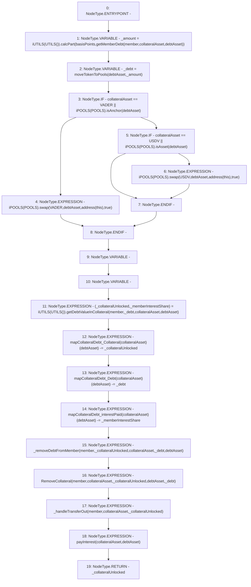

# Context: Router.repayForMember

**Contract:** `Router` (Inherits: None)
**Signature:** `repayForMember(address,uint256,address,address) returns (uint256)`
**Method Selector ID:** `0xe9b6e448`
**Visibility:** `public`
**Environment-Free:** `No (reads EVM state context)`
**Modifiers:** None

### State Variables Interaction
- **Reads:** POOLS, USDV, VADER, mapCollateralDebt_Collateral, mapCollateralDebt_Debt, mapCollateralDebt_interestPaid
- **Writes:** mapCollateralDebt_Collateral, mapCollateralDebt_Debt, mapCollateralDebt_interestPaid

### Environment & Verification Flags
- **Uses Foundry Cheatcodes:** No
- **Has Echidna Properties:** No

### Internal Calls Tree
- None

### External Calls / Value Transfers
- `iPOOLS.TMP_491(bool) = HIGH_LEVEL_CALL, dest:TMP_490(iPOOLS), function:isAsset, arguments:['debtAsset']  `
- `iUTILS.TUPLE_4(uint256,uint256) = HIGH_LEVEL_CALL, dest:TMP_497(iUTILS), function:getDebtValueInCollateral, arguments:['member', '_debt', 'collateralAsset', 'debtAsset']  `
- `iUTILS.TMP_480(uint256) = HIGH_LEVEL_CALL, dest:TMP_478(iUTILS), function:calcPart, arguments:['basisPoints', 'TMP_479']  `
- `iPOOLS.TMP_488(uint256) = HIGH_LEVEL_CALL, dest:TMP_486(iPOOLS), function:swap, arguments:['VADER', 'debtAsset', 'TMP_487', 'True']  `
- `iPOOLS.TMP_484(bool) = HIGH_LEVEL_CALL, dest:TMP_483(iPOOLS), function:isAnchor, arguments:['debtAsset']  `
- `iPOOLS.TMP_495(uint256) = HIGH_LEVEL_CALL, dest:TMP_493(iPOOLS), function:swap, arguments:['USDV', 'debtAsset', 'TMP_494', 'True']  `

### Control Flow Graph (CFG)


### Source Mapping
Declared in: `contracts/Router.sol` on lines **338** to **355**

```solidity
    function repayForMember(address member, uint basisPoints, address collateralAsset, address debtAsset) public returns (uint){
        uint _amount = iUTILS(UTILS()).calcPart(basisPoints, getMemberDebt(member, collateralAsset, debtAsset));
        uint _debt = moveTokenToPools(debtAsset, _amount);    // Get Debt
        if(collateralAsset == VADER || iPOOLS(POOLS).isAnchor(debtAsset)){
            iPOOLS(POOLS).swap(VADER, debtAsset, address(this), true);           // Swap Debt to Base back here
        } else if(collateralAsset == USDV || iPOOLS(POOLS).isAsset(debtAsset)) {
            iPOOLS(POOLS).swap(USDV, debtAsset, address(this), true);           // Swap Debt to Base back here
        }
        (uint _collateralUnlocked,  uint _memberInterestShare) = iUTILS(UTILS()).getDebtValueInCollateral(member, _debt, collateralAsset, debtAsset); // Unlock collateral that is pro-rata to re-paid debt ($50/$100 = 50%)
        mapCollateralDebt_Collateral[collateralAsset][debtAsset] -= _collateralUnlocked;               // Update collateral 
        mapCollateralDebt_Debt[collateralAsset][debtAsset] -= _debt;                   // Update debt 
        mapCollateralDebt_interestPaid[collateralAsset][debtAsset] -= _memberInterestShare;
        _removeDebtFromMember(member, _collateralUnlocked, collateralAsset, _debt, debtAsset);  // Remove
        emit RemoveCollateral(member, collateralAsset, _collateralUnlocked, debtAsset, _debt);
        _handleTransferOut(member, collateralAsset, _collateralUnlocked);
        payInterest(collateralAsset, debtAsset);
        return _collateralUnlocked;
    }

```
