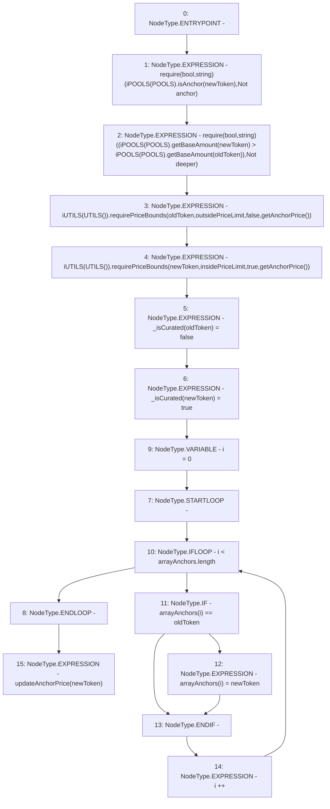

# Context: Router.replaceAnchor

**Contract:** `Router` (Inherits: None)
**Signature:** `replaceAnchor(address,address)`
**Method Selector ID:** `0x1df6acfd`
**Visibility:** `external`
**Environment-Free:** `Yes`
**Modifiers:** None

### State Variables Interaction
- **Reads:** POOLS, arrayAnchors, insidePriceLimit, outsidePriceLimit
- **Writes:** _isCurated, arrayAnchors

### Assertion Checks & Business Requirements
- require/assert: `require(bool,string)(iPOOLS(POOLS).isAnchor(newToken),Not anchor)`
- require/assert: `require(bool,string)((iPOOLS(POOLS).getBaseAmount(newToken) > iPOOLS(POOLS).getBaseAmount(oldToken)),Not deeper)`

### Environment & Verification Flags
- **Uses Foundry Cheatcodes:** No
- **Has Echidna Properties:** No

### Internal Calls Tree
- None

### External Calls / Value Transfers
- `iPOOLS.TMP_411(bool) = HIGH_LEVEL_CALL, dest:TMP_410(iPOOLS), function:isAnchor, arguments:['newToken']  `
- `iUTILS.HIGH_LEVEL_CALL, dest:TMP_424(iUTILS), function:requirePriceBounds, arguments:['newToken', 'insidePriceLimit', 'True', 'TMP_425']  `
- `iPOOLS.TMP_414(uint256) = HIGH_LEVEL_CALL, dest:TMP_413(iPOOLS), function:getBaseAmount, arguments:['newToken']  `
- `iUTILS.HIGH_LEVEL_CALL, dest:TMP_420(iUTILS), function:requirePriceBounds, arguments:['oldToken', 'outsidePriceLimit', 'False', 'TMP_421']  `
- `iPOOLS.TMP_416(uint256) = HIGH_LEVEL_CALL, dest:TMP_415(iPOOLS), function:getBaseAmount, arguments:['oldToken']  `

### Control Flow Graph (CFG)


### Source Mapping
Declared in: `contracts/Router.sol` on lines **254** to **267**

```solidity
    function replaceAnchor(address oldToken, address newToken) external {
        require(iPOOLS(POOLS).isAnchor(newToken), "Not anchor");
        require((iPOOLS(POOLS).getBaseAmount(newToken) > iPOOLS(POOLS).getBaseAmount(oldToken)), "Not deeper");
        iUTILS(UTILS()).requirePriceBounds(oldToken, outsidePriceLimit, false, getAnchorPrice());                             // if price oldToken >5%
        iUTILS(UTILS()).requirePriceBounds(newToken, insidePriceLimit, true, getAnchorPrice());                               // if price newToken <2%
        _isCurated[oldToken] = false; 
        _isCurated[newToken] = true; 
        for(uint i = 0; i<arrayAnchors.length; i++){
            if(arrayAnchors[i] == oldToken){
                arrayAnchors[i] = newToken;
            }
        }
        updateAnchorPrice(newToken);
    }

```
