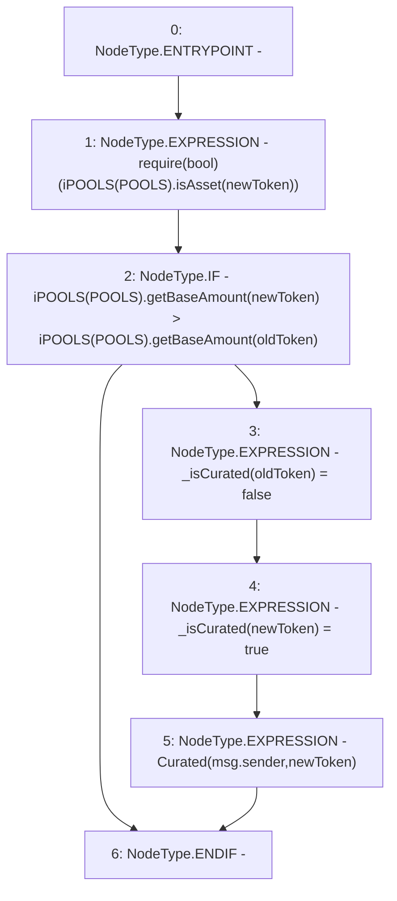

# Context: Router.replacePool

**Contract:** `Router` (Inherits: None)
**Signature:** `replacePool(address,address)`
**Method Selector ID:** `0xe8b8cfa0`
**Visibility:** `external`
**Environment-Free:** `No (reads EVM state context)`
**Modifiers:** None

### State Variables Interaction
- **Reads:** POOLS
- **Writes:** _isCurated

### Assertion Checks & Business Requirements
- require/assert: `require(bool)(iPOOLS(POOLS).isAsset(newToken))`

### Environment & Verification Flags
- **Uses Foundry Cheatcodes:** No
- **Has Echidna Properties:** No

### Internal Calls Tree
- None

### External Calls / Value Transfers
- `iPOOLS.TMP_387(bool) = HIGH_LEVEL_CALL, dest:TMP_386(iPOOLS), function:isAsset, arguments:['newToken']  `
- `iPOOLS.TMP_390(uint256) = HIGH_LEVEL_CALL, dest:TMP_389(iPOOLS), function:getBaseAmount, arguments:['newToken']  `
- `iPOOLS.TMP_392(uint256) = HIGH_LEVEL_CALL, dest:TMP_391(iPOOLS), function:getBaseAmount, arguments:['oldToken']  `

### Control Flow Graph (CFG)


### Source Mapping
Declared in: `contracts/Router.sol` on lines **234** to **241**

```solidity
    function replacePool(address oldToken, address newToken) external {
        require(iPOOLS(POOLS).isAsset(newToken));
        if(iPOOLS(POOLS).getBaseAmount(newToken) > iPOOLS(POOLS).getBaseAmount(oldToken)){ // Must be deeper
            _isCurated[oldToken] = false;
            _isCurated[newToken] = true;
            emit Curated(msg.sender, newToken);
        }
    }

```
