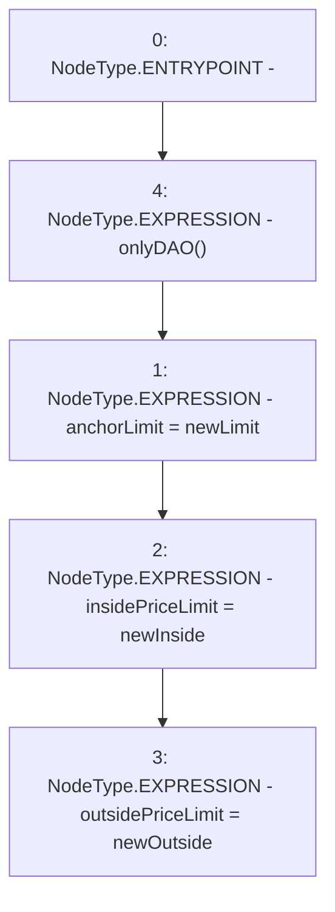

# Context: Router.setAnchorParams

**Contract:** `Router` (Inherits: None)
**Signature:** `setAnchorParams(uint256,uint256,uint256)`
**Method Selector ID:** `0x2e2d0856`
**Visibility:** `external`
**Environment-Free:** `No (reads EVM state context)`
**Modifiers:**
- `onlyDAO`
  ```solidity
  modifier onlyDAO() {
          require(msg.sender == DAO(), "Not DAO");
          _;
      }
  ```

### State Variables Interaction
- **Reads:** None
- **Writes:** anchorLimit, insidePriceLimit, outsidePriceLimit

### Environment & Verification Flags
- **Uses Foundry Cheatcodes:** No
- **Has Echidna Properties:** No

### Internal Calls Tree
- None

### External Calls / Value Transfers
- None

### Control Flow Graph (CFG)


### Source Mapping
Declared in: `contracts/Router.sol` on lines **98** to **102**

```solidity
    function setAnchorParams(uint newLimit, uint newInside, uint newOutside) external onlyDAO {
        anchorLimit = newLimit;
        insidePriceLimit = newInside;
        outsidePriceLimit = newOutside;
    }

```
