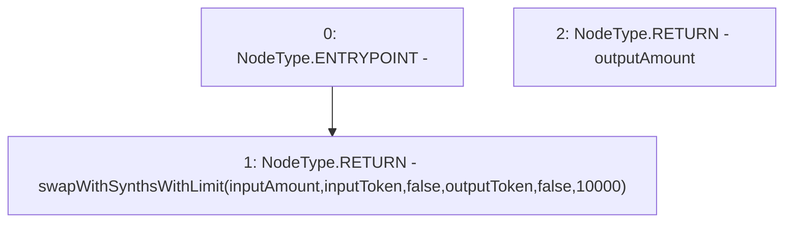

# Context: Router.swap

**Contract:** `Router` (Inherits: None)
**Signature:** `swap(uint256,address,address) returns (uint256)`
**Method Selector ID:** `0x2b7f0923`
**Visibility:** `external`
**Environment-Free:** `No (reads EVM state context)`
**Modifiers:** None

### State Variables Interaction
- **Reads:** None
- **Writes:** None

### Environment & Verification Flags
- **Uses Foundry Cheatcodes:** No
- **Has Echidna Properties:** No

### Internal Calls Tree
- None

### External Calls / Value Transfers
- None

### Control Flow Graph (CFG)


### Source Mapping
Declared in: `contracts/Router.sol` on lines **122** to **124**

```solidity
    function swap(uint inputAmount, address inputToken, address outputToken) external returns (uint outputAmount) {
        return swapWithSynthsWithLimit(inputAmount, inputToken, false, outputToken, false, 10000);
    }

```
