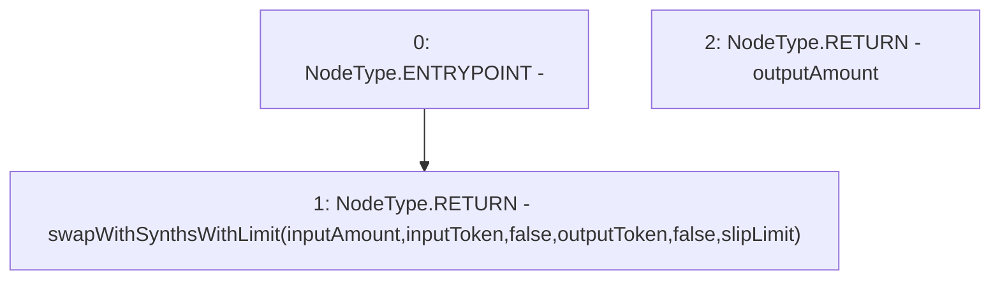

# Context: Router.swapWithLimit

**Contract:** `Router` (Inherits: None)
**Signature:** `swapWithLimit(uint256,address,address,uint256) returns (uint256)`
**Method Selector ID:** `0x1a609827`
**Visibility:** `external`
**Environment-Free:** `No (reads EVM state context)`
**Modifiers:** None

### State Variables Interaction
- **Reads:** None
- **Writes:** None

### Environment & Verification Flags
- **Uses Foundry Cheatcodes:** No
- **Has Echidna Properties:** No

### Internal Calls Tree
- None

### External Calls / Value Transfers
- None

### Control Flow Graph (CFG)


### Source Mapping
Declared in: `contracts/Router.sol` on lines **125** to **127**

```solidity
    function swapWithLimit(uint inputAmount, address inputToken, address outputToken, uint slipLimit) external returns (uint outputAmount) {
        return swapWithSynthsWithLimit(inputAmount, inputToken, false, outputToken, false, slipLimit);
    }

```
