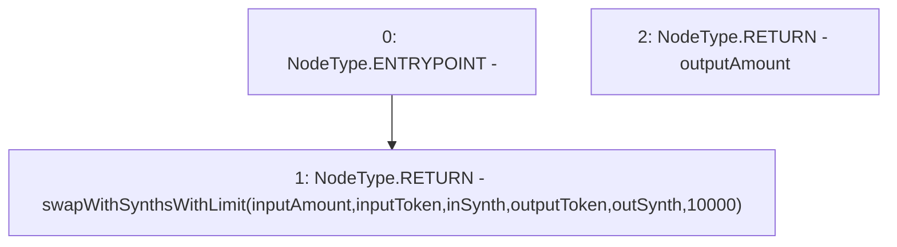

# Context: Router.swapWithSynths

**Contract:** `Router` (Inherits: None)
**Signature:** `swapWithSynths(uint256,address,bool,address,bool) returns (uint256)`
**Method Selector ID:** `0x99a485f5`
**Visibility:** `external`
**Environment-Free:** `No (reads EVM state context)`
**Modifiers:** None

### State Variables Interaction
- **Reads:** None
- **Writes:** None

### Environment & Verification Flags
- **Uses Foundry Cheatcodes:** No
- **Has Echidna Properties:** No

### Internal Calls Tree
- None

### External Calls / Value Transfers
- None

### Control Flow Graph (CFG)


### Source Mapping
Declared in: `contracts/Router.sol` on lines **129** to **131**

```solidity
    function swapWithSynths(uint inputAmount, address inputToken, bool inSynth, address outputToken, bool outSynth) external returns (uint outputAmount) {
        return swapWithSynthsWithLimit(inputAmount, inputToken, inSynth, outputToken, outSynth, 10000);
    }

```
