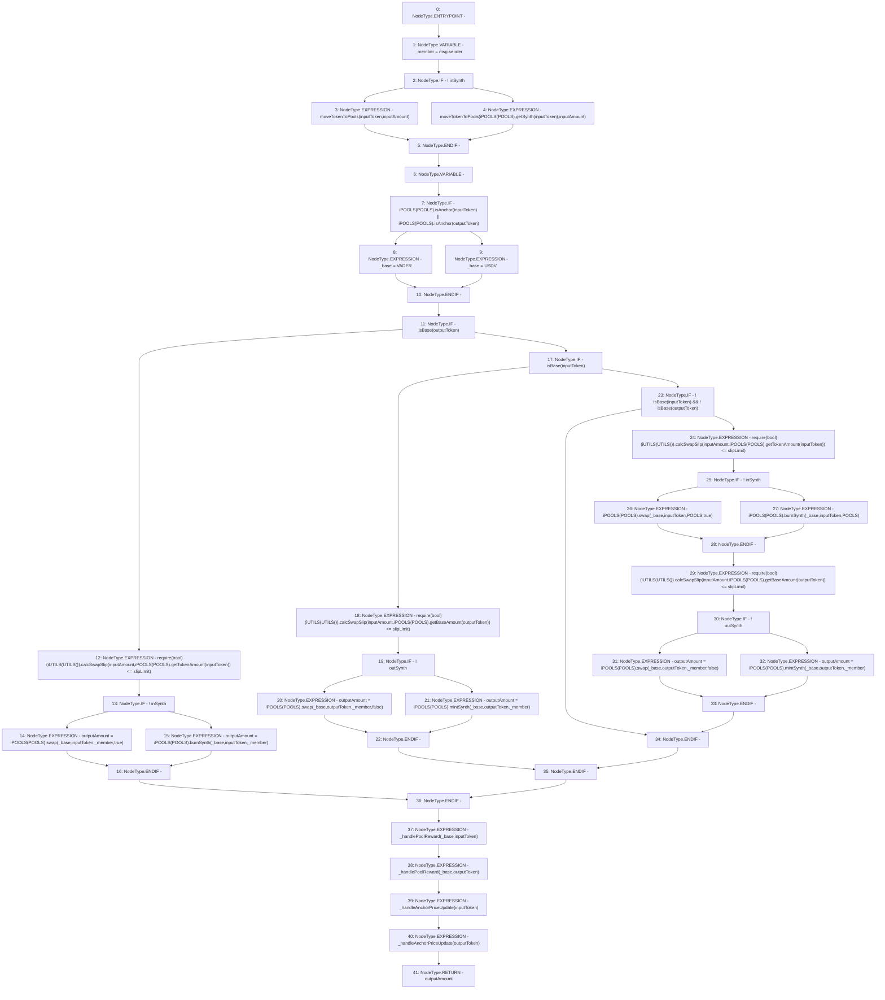

# Context: Router.swapWithSynthsWithLimit

**Contract:** `Router` (Inherits: None)
**Signature:** `swapWithSynthsWithLimit(uint256,address,bool,address,bool,uint256) returns (uint256)`
**Method Selector ID:** `0x37785d21`
**Visibility:** `public`
**Environment-Free:** `No (reads EVM state context)`
**Modifiers:** None

### State Variables Interaction
- **Reads:** POOLS, USDV, VADER
- **Writes:** None

### Assertion Checks & Business Requirements
- require/assert: `require(bool)(iUTILS(UTILS()).calcSwapSlip(inputAmount,iPOOLS(POOLS).getTokenAmount(inputToken)) <= slipLimit)`
- require/assert: `require(bool)(iUTILS(UTILS()).calcSwapSlip(inputAmount,iPOOLS(POOLS).getBaseAmount(outputToken)) <= slipLimit)`
- require/assert: `require(bool)(iUTILS(UTILS()).calcSwapSlip(inputAmount,iPOOLS(POOLS).getTokenAmount(inputToken)) <= slipLimit)`
- require/assert: `require(bool)(iUTILS(UTILS()).calcSwapSlip(inputAmount,iPOOLS(POOLS).getBaseAmount(outputToken)) <= slipLimit)`

### Environment & Verification Flags
- **Uses Foundry Cheatcodes:** No
- **Has Echidna Properties:** No

### Internal Calls Tree
- None

### External Calls / Value Transfers
- `iPOOLS.TMP_343(uint256) = HIGH_LEVEL_CALL, dest:TMP_342(iPOOLS), function:swap, arguments:['_base', 'outputToken', '_member', 'False']  `
- `iPOOLS.TMP_287(bool) = HIGH_LEVEL_CALL, dest:TMP_286(iPOOLS), function:isAnchor, arguments:['inputToken']  `
- `iPOOLS.TMP_333(uint256) = HIGH_LEVEL_CALL, dest:TMP_332(iPOOLS), function:burnSynth, arguments:['_base', 'inputToken', 'POOLS']  `
- `iPOOLS.TMP_314(uint256) = HIGH_LEVEL_CALL, dest:TMP_313(iPOOLS), function:swap, arguments:['_base', 'outputToken', '_member', 'False']  `
- `iPOOLS.TMP_325(uint256) = HIGH_LEVEL_CALL, dest:TMP_324(iPOOLS), function:getTokenAmount, arguments:['inputToken']  `
- `iPOOLS.TMP_301(uint256) = HIGH_LEVEL_CALL, dest:TMP_300(iPOOLS), function:swap, arguments:['_base', 'inputToken', '_member', 'True']  `
- `iUTILS.TMP_338(uint256) = HIGH_LEVEL_CALL, dest:TMP_335(iUTILS), function:calcSwapSlip, arguments:['inputAmount', 'TMP_337']  `
- `iUTILS.TMP_309(uint256) = HIGH_LEVEL_CALL, dest:TMP_306(iUTILS), function:calcSwapSlip, arguments:['inputAmount', 'TMP_308']  `
- `iUTILS.TMP_296(uint256) = HIGH_LEVEL_CALL, dest:TMP_293(iUTILS), function:calcSwapSlip, arguments:['inputAmount', 'TMP_295']  `
- `iPOOLS.TMP_331(uint256) = HIGH_LEVEL_CALL, dest:TMP_330(iPOOLS), function:swap, arguments:['_base', 'inputToken', 'POOLS', 'True']  `
- `iPOOLS.TMP_345(uint256) = HIGH_LEVEL_CALL, dest:TMP_344(iPOOLS), function:mintSynth, arguments:['_base', 'outputToken', '_member']  `
- `iPOOLS.TMP_303(uint256) = HIGH_LEVEL_CALL, dest:TMP_302(iPOOLS), function:burnSynth, arguments:['_base', 'inputToken', '_member']  `
- `iPOOLS.TMP_316(uint256) = HIGH_LEVEL_CALL, dest:TMP_315(iPOOLS), function:mintSynth, arguments:['_base', 'outputToken', '_member']  `
- `iPOOLS.TMP_295(uint256) = HIGH_LEVEL_CALL, dest:TMP_294(iPOOLS), function:getTokenAmount, arguments:['inputToken']  `
- `iPOOLS.TMP_289(bool) = HIGH_LEVEL_CALL, dest:TMP_288(iPOOLS), function:isAnchor, arguments:['outputToken']  `
- `iPOOLS.TMP_337(uint256) = HIGH_LEVEL_CALL, dest:TMP_336(iPOOLS), function:getBaseAmount, arguments:['outputToken']  `
- `iUTILS.TMP_326(uint256) = HIGH_LEVEL_CALL, dest:TMP_323(iUTILS), function:calcSwapSlip, arguments:['inputAmount', 'TMP_325']  `
- `iPOOLS.TMP_284(address) = HIGH_LEVEL_CALL, dest:TMP_283(iPOOLS), function:getSynth, arguments:['inputToken']  `
- `iPOOLS.TMP_308(uint256) = HIGH_LEVEL_CALL, dest:TMP_307(iPOOLS), function:getBaseAmount, arguments:['outputToken']  `

### Control Flow Graph (CFG)


### Source Mapping
Declared in: `contracts/Router.sol` on lines **133** to **181**

```solidity
    function swapWithSynthsWithLimit(uint inputAmount, address inputToken, bool inSynth, address outputToken, bool outSynth, uint slipLimit) public returns (uint outputAmount) {
        address _member = msg.sender;
        if(!inSynth){
            moveTokenToPools(inputToken, inputAmount);
        } else {
            moveTokenToPools(iPOOLS(POOLS).getSynth(inputToken), inputAmount);
        }
        address _base;
        if(iPOOLS(POOLS).isAnchor(inputToken) || iPOOLS(POOLS).isAnchor(outputToken)) {
            _base = VADER;
        } else {
            _base = USDV;
        }
        if (isBase(outputToken)) {
            // Token||Synth -> BASE
            require(iUTILS(UTILS()).calcSwapSlip(inputAmount, iPOOLS(POOLS).getTokenAmount(inputToken)) <= slipLimit);
            if(!inSynth){
                outputAmount = iPOOLS(POOLS).swap(_base, inputToken, _member, true);
            } else {
                outputAmount = iPOOLS(POOLS).burnSynth(_base, inputToken, _member);
            }
        } else if (isBase(inputToken)) {
            // BASE -> Token||Synth
            require(iUTILS(UTILS()).calcSwapSlip(inputAmount, iPOOLS(POOLS).getBaseAmount(outputToken)) <= slipLimit);
            if(!outSynth){
                outputAmount = iPOOLS(POOLS).swap(_base, outputToken, _member, false);
            } else {
                outputAmount = iPOOLS(POOLS).mintSynth(_base, outputToken, _member);
            }
        } else if (!isBase(inputToken) && !isBase(outputToken)) {
            // Token||Synth -> Token||Synth
            require(iUTILS(UTILS()).calcSwapSlip(inputAmount, iPOOLS(POOLS).getTokenAmount(inputToken)) <= slipLimit);
            if(!inSynth){
                iPOOLS(POOLS).swap(_base, inputToken, POOLS, true);
            } else {
                iPOOLS(POOLS).burnSynth(_base, inputToken, POOLS);
            }
            require(iUTILS(UTILS()).calcSwapSlip(inputAmount, iPOOLS(POOLS).getBaseAmount(outputToken)) <= slipLimit);
            if(!outSynth){
                outputAmount = iPOOLS(POOLS).swap(_base, outputToken, _member, false);
            } else {
                outputAmount = iPOOLS(POOLS).mintSynth(_base, outputToken, _member);
            }
        }
        _handlePoolReward(_base, inputToken);
        _handlePoolReward(_base, outputToken);
        _handleAnchorPriceUpdate(inputToken);
        _handleAnchorPriceUpdate(outputToken); 
    }

```
