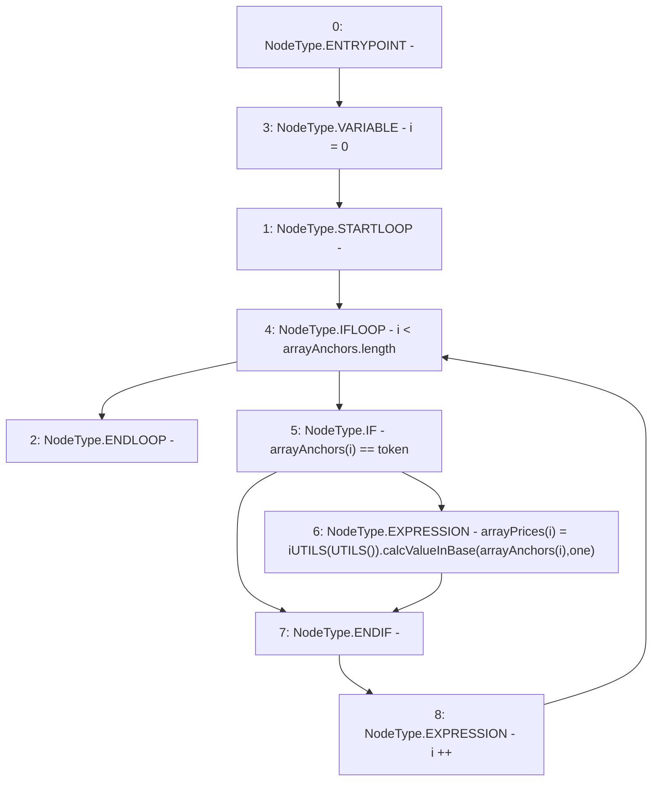

# Context: Router.updateAnchorPrice

**Contract:** `Router` (Inherits: None)
**Signature:** `updateAnchorPrice(address)`
**Method Selector ID:** `0xe2e1e48f`
**Visibility:** `public`
**Environment-Free:** `Yes`
**Modifiers:** None

### State Variables Interaction
- **Reads:** arrayAnchors, one
- **Writes:** arrayPrices

### Environment & Verification Flags
- **Uses Foundry Cheatcodes:** No
- **Has Echidna Properties:** No

### Internal Calls Tree
- None

### External Calls / Value Transfers
- `iUTILS.TMP_435(uint256) = HIGH_LEVEL_CALL, dest:TMP_434(iUTILS), function:calcValueInBase, arguments:['REF_241', 'one']  `

### Control Flow Graph (CFG)


### Source Mapping
Declared in: `contracts/Router.sol` on lines **270** to **276**

```solidity
    function updateAnchorPrice(address token) public {
        for(uint i = 0; i<arrayAnchors.length; i++){
            if(arrayAnchors[i] == token){
                arrayPrices[i] = iUTILS(UTILS()).calcValueInBase(arrayAnchors[i], one);
            }
        }
    }

```
