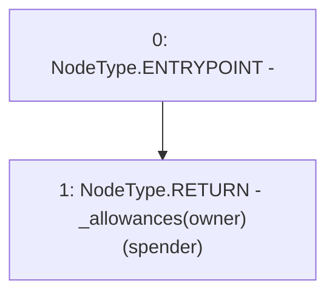

# Context: Synth.allowance

**Contract:** `Synth` (Inherits: iERC20)
**Signature:** `allowance(address,address) returns (uint256)`
**Method Selector ID:** `0xdd62ed3e`
**Visibility:** `public`
**Environment-Free:** `Yes`
**Modifiers:** None

### State Variables Interaction
- **Reads:** _allowances
- **Writes:** None

### Environment & Verification Flags
- **Uses Foundry Cheatcodes:** No
- **Has Echidna Properties:** No

### Internal Calls Tree
- None

### External Calls / Value Transfers
- None

### Control Flow Graph (CFG)


### Source Mapping
Declared in: `contracts/Synth.sol` on lines **43** to **45**

```solidity
    function allowance(address owner, address spender) public view virtual override returns (uint) {
        return _allowances[owner][spender];
    }

```
