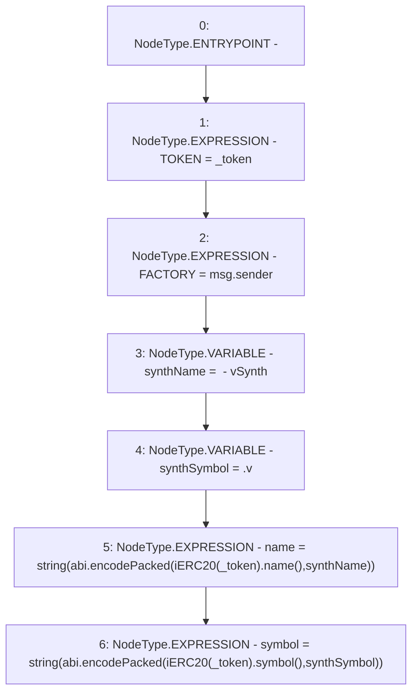

# Context: Synth.constructor

**Contract:** `Synth` (Inherits: iERC20)
**Signature:** `constructor(address)`
**Method Selector ID:** `0xf8a6c595`
**Visibility:** `public`
**Environment-Free:** `No (reads EVM state context)`
**Modifiers:** None

### State Variables Interaction
- **Reads:** None
- **Writes:** FACTORY, TOKEN, name, symbol

### Environment & Verification Flags
- **Uses Foundry Cheatcodes:** No
- **Has Echidna Properties:** No

### Internal Calls Tree
- None

### External Calls / Value Transfers
- `iERC20.TMP_609(string) = HIGH_LEVEL_CALL, dest:TMP_608(iERC20), function:symbol, arguments:[]  `
- `iERC20.TMP_605(string) = HIGH_LEVEL_CALL, dest:TMP_604(iERC20), function:name, arguments:[]  `

### Control Flow Graph (CFG)


### Source Mapping
Declared in: `contracts/Synth.sol` on lines **29** to **36**

```solidity
    constructor(address _token){
        TOKEN = _token;
        FACTORY = msg.sender;
        string memory synthName = " - vSynth";
        string memory synthSymbol = ".v";
        name = string(abi.encodePacked(iERC20(_token).name(), synthName));
        symbol = string(abi.encodePacked(iERC20(_token).symbol(), synthSymbol));
    }

```
