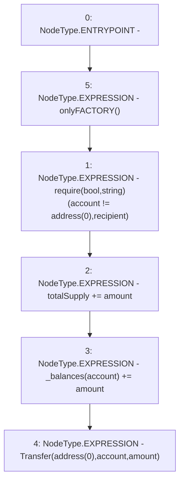

# Context: Synth.mint

**Contract:** `Synth` (Inherits: iERC20)
**Signature:** `mint(address,uint256)`
**Method Selector ID:** `0x40c10f19`
**Visibility:** `external`
**Environment-Free:** `No (reads EVM state context)`
**Modifiers:**
- `onlyFACTORY`
  ```solidity
  modifier onlyFACTORY() {
          require(msg.sender == FACTORY, "!FACTORY");
          _;
      }
  ```

### State Variables Interaction
- **Reads:** _balances, totalSupply
- **Writes:** _balances, totalSupply

### Assertion Checks & Business Requirements
- require/assert: `require(bool,string)(account != address(0),recipient)`

### Environment & Verification Flags
- **Uses Foundry Cheatcodes:** No
- **Has Echidna Properties:** No

### Internal Calls Tree
- None

### External Calls / Value Transfers
- None

### Control Flow Graph (CFG)


### Source Mapping
Declared in: `contracts/Synth.sol` on lines **86** to **91**

```solidity
    function mint(address account, uint amount) external virtual onlyFACTORY {
        require(account != address(0), "recipient");
        totalSupply += amount;
        _balances[account] += amount;
        emit Transfer(address(0), account, amount);
    }

```
