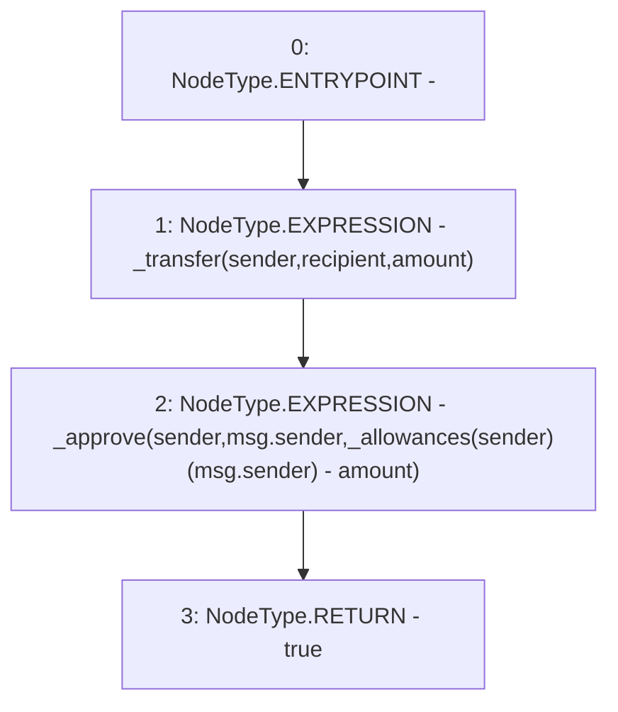

# Context: Synth.transferFrom

**Contract:** `Synth` (Inherits: iERC20)
**Signature:** `transferFrom(address,address,uint256) returns (bool)`
**Method Selector ID:** `0x23b872dd`
**Visibility:** `public`
**Environment-Free:** `No (reads EVM state context)`
**Modifiers:** None

### State Variables Interaction
- **Reads:** _allowances
- **Writes:** None

### Environment & Verification Flags
- **Uses Foundry Cheatcodes:** No
- **Has Echidna Properties:** No

### Internal Calls Tree
- None

### External Calls / Value Transfers
- None

### Control Flow Graph (CFG)


### Source Mapping
Declared in: `contracts/Synth.sol` on lines **64** to **68**

```solidity
    function transferFrom(address sender, address recipient, uint amount) public virtual override returns (bool) {
        _transfer(sender, recipient, amount);
        _approve(sender, msg.sender, _allowances[sender][msg.sender] - amount);
        return true;
    }

```
