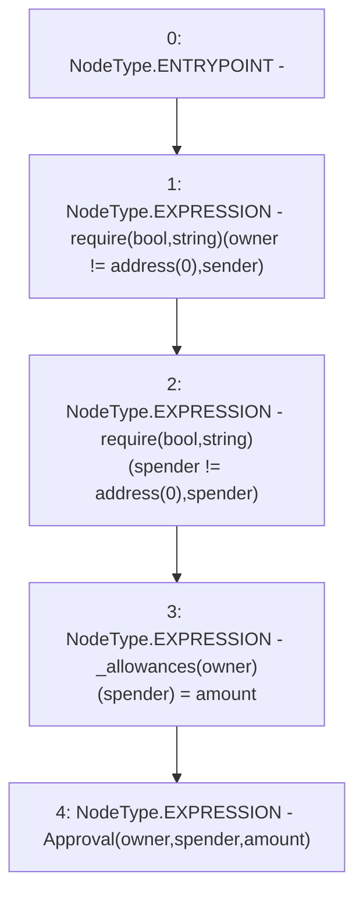

# Context: Token1._approve

**Contract:** `Token1` (Inherits: iERC20)
**Signature:** `_approve(address,address,uint256)`
**Method Selector ID:** `Internal (No Method ID)`
**Visibility:** `internal`
**Environment-Free:** `Yes`
**Modifiers:** None

### State Variables Interaction
- **Reads:** None
- **Writes:** _allowances

### Assertion Checks & Business Requirements
- require/assert: `require(bool,string)(owner != address(0),sender)`
- require/assert: `require(bool,string)(spender != address(0),spender)`

### Environment & Verification Flags
- **Uses Foundry Cheatcodes:** No
- **Has Echidna Properties:** No

### Internal Calls Tree
- None

### External Calls / Value Transfers
- `TMP_656(None) = SOLIDITY_CALL require(bool,string)(TMP_655,sender)`

### Control Flow Graph (CFG)


### Source Mapping
Declared in: `contracts/Token1.sol` on lines **45** to **50**

```solidity
    function _approve(address owner, address spender, uint amount) internal virtual {
        require(owner != address(0), "sender");
        require(spender != address(0), "spender");
        _allowances[owner][spender] = amount;
        emit Approval(owner, spender, amount);
    }

```
