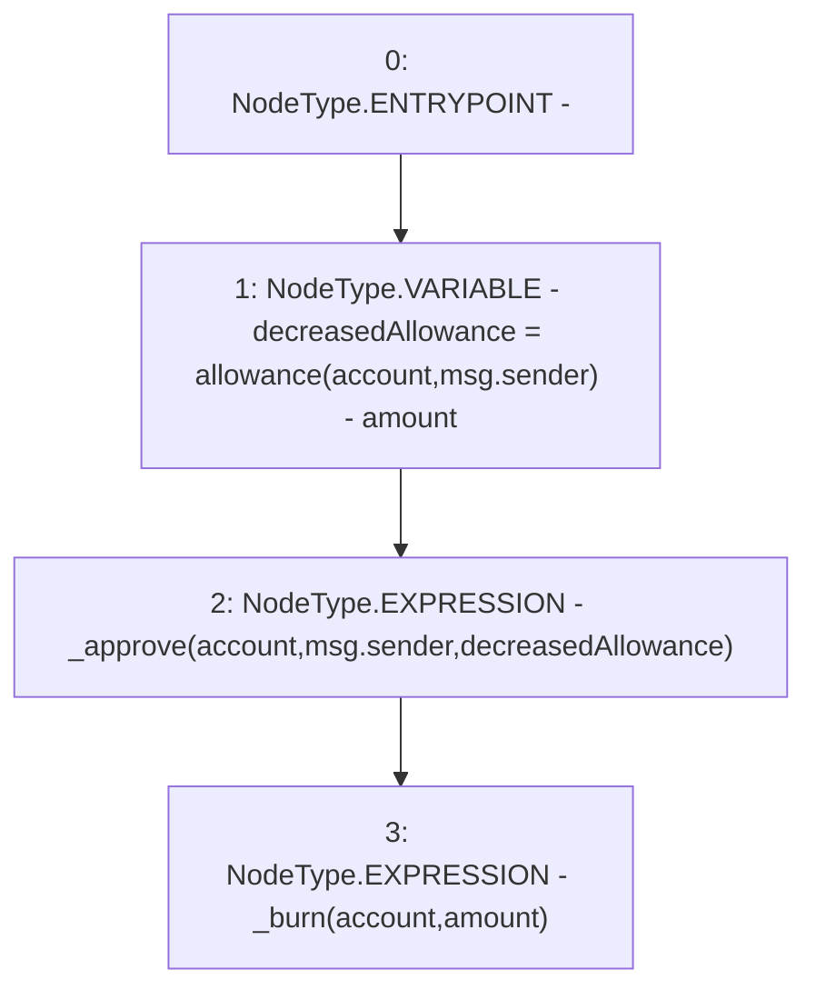

# Context: Token1.burnFrom

**Contract:** `Token1` (Inherits: iERC20)
**Signature:** `burnFrom(address,uint256)`
**Method Selector ID:** `0x79cc6790`
**Visibility:** `public`
**Environment-Free:** `No (reads EVM state context)`
**Modifiers:** None

### State Variables Interaction
- **Reads:** None
- **Writes:** None

### Environment & Verification Flags
- **Uses Foundry Cheatcodes:** No
- **Has Echidna Properties:** No

### Internal Calls Tree
- None

### External Calls / Value Transfers
- None

### Control Flow Graph (CFG)


### Source Mapping
Declared in: `contracts/Token1.sol` on lines **84** to **88**

```solidity
    function burnFrom(address account, uint amount) public virtual override {
        uint decreasedAllowance = allowance(account, msg.sender) - amount;
        _approve(account, msg.sender, decreasedAllowance);
        _burn(account, amount);
    }

```
