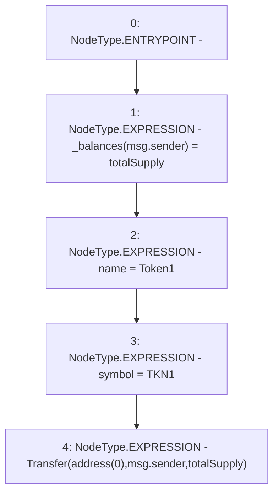

# Context: Token1.constructor

**Contract:** `Token1` (Inherits: iERC20)
**Signature:** `constructor()`
**Method Selector ID:** `0x90fa17bb`
**Visibility:** `public`
**Environment-Free:** `No (reads EVM state context)`
**Modifiers:** None

### State Variables Interaction
- **Reads:** totalSupply
- **Writes:** _balances, name, symbol

### Environment & Verification Flags
- **Uses Foundry Cheatcodes:** No
- **Has Echidna Properties:** No

### Internal Calls Tree
- None

### External Calls / Value Transfers
- None

### Control Flow Graph (CFG)


### Source Mapping
Declared in: `contracts/Token1.sol` on lines **21** to **26**

```solidity
    constructor(){
        _balances[msg.sender] = totalSupply;
        name = "Token1";
        symbol  = "TKN1";
        emit Transfer(address(0), msg.sender, totalSupply);
    }

```
