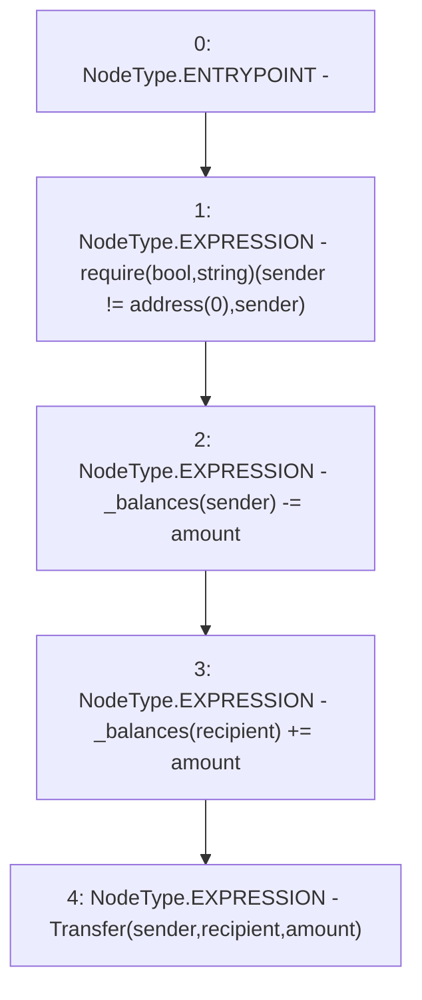

# Context: Token2._transfer

**Contract:** `Token2` (Inherits: iERC20)
**Signature:** `_transfer(address,address,uint256)`
**Method Selector ID:** `Internal (No Method ID)`
**Visibility:** `internal`
**Environment-Free:** `Yes`
**Modifiers:** None

### State Variables Interaction
- **Reads:** _balances
- **Writes:** _balances

### Assertion Checks & Business Requirements
- require/assert: `require(bool,string)(sender != address(0),sender)`

### Environment & Verification Flags
- **Uses Foundry Cheatcodes:** No
- **Has Echidna Properties:** No

### Internal Calls Tree
- None

### External Calls / Value Transfers
- `TMP_705(None) = SOLIDITY_CALL require(bool,string)(TMP_704,sender)`

### Control Flow Graph (CFG)


### Source Mapping
Declared in: `contracts/Token2.sol` on lines **67** to **72**

```solidity
    function _transfer(address sender, address recipient, uint amount) internal virtual {
        require(sender != address(0), "sender");
        _balances[sender] -= amount;
        _balances[recipient] += amount;
        emit Transfer(sender, recipient, amount);
    }

```
