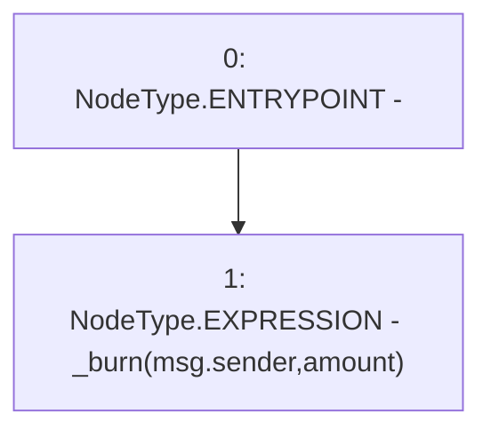

# Context: Token2.burn

**Contract:** `Token2` (Inherits: iERC20)
**Signature:** `burn(uint256)`
**Method Selector ID:** `0x42966c68`
**Visibility:** `public`
**Environment-Free:** `No (reads EVM state context)`
**Modifiers:** None

### State Variables Interaction
- **Reads:** None
- **Writes:** None

### Environment & Verification Flags
- **Uses Foundry Cheatcodes:** No
- **Has Echidna Properties:** No

### Internal Calls Tree
- None

### External Calls / Value Transfers
- None

### Control Flow Graph (CFG)


### Source Mapping
Declared in: `contracts/Token2.sol` on lines **81** to **83**

```solidity
    function burn(uint amount) public virtual override {
        _burn(msg.sender, amount);
    }

```
