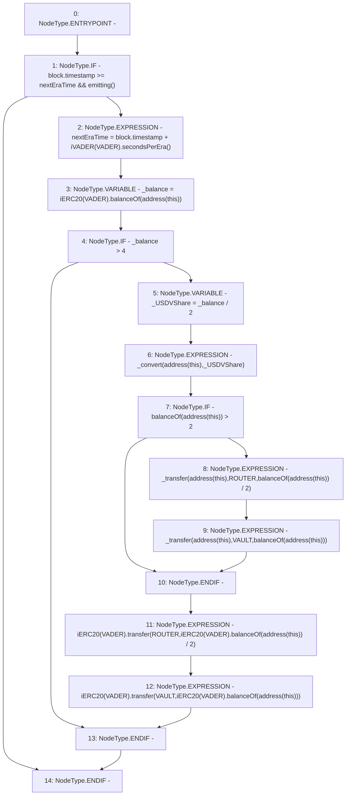

# Context: USDV._checkIncentives

**Contract:** `USDV` (Inherits: iERC20)
**Signature:** `_checkIncentives()`
**Method Selector ID:** `Internal (No Method ID)`
**Visibility:** `private`
**Environment-Free:** `No (reads EVM state context)`
**Modifiers:** None

### State Variables Interaction
- **Reads:** ROUTER, VADER, VAULT, nextEraTime
- **Writes:** nextEraTime

### Environment & Verification Flags
- **Uses Foundry Cheatcodes:** No
- **Has Echidna Properties:** No

### Internal Calls Tree
- None

### External Calls / Value Transfers
- `iVADER.TMP_774(uint256) = HIGH_LEVEL_CALL, dest:TMP_773(iVADER), function:secondsPerEra, arguments:[]  `
- `iERC20.TMP_804(uint256) = HIGH_LEVEL_CALL, dest:TMP_802(iERC20), function:balanceOf, arguments:['TMP_803']  `
- `iERC20.TMP_778(uint256) = HIGH_LEVEL_CALL, dest:TMP_776(iERC20), function:balanceOf, arguments:['TMP_777']  `
- `iERC20.TMP_800(bool) = HIGH_LEVEL_CALL, dest:TMP_795(iERC20), function:transfer, arguments:['ROUTER', 'TMP_799']  `
- `iERC20.TMP_798(uint256) = HIGH_LEVEL_CALL, dest:TMP_796(iERC20), function:balanceOf, arguments:['TMP_797']  `
- `iERC20.TMP_805(bool) = HIGH_LEVEL_CALL, dest:TMP_801(iERC20), function:transfer, arguments:['VAULT', 'TMP_804']  `

### Control Flow Graph (CFG)


### Source Mapping
Declared in: `contracts/USDV.sol` on lines **146** to **161**

```solidity
    function _checkIncentives() private {
        if (block.timestamp >= nextEraTime && emitting()) {                 // If new Era
            nextEraTime = block.timestamp + iVADER(VADER).secondsPerEra(); 
            uint _balance = iERC20(VADER).balanceOf(address(this));         // Get spare VADER
            if(_balance > 4){
                uint _USDVShare = _balance/2;                                   // Get 50%
                _convert(address(this), _USDVShare);                            // Convert it
                if(balanceOf(address(this)) > 2){
                    _transfer(address(this), ROUTER, balanceOf(address(this)) / 2);              // Send half USDV to ROUTER
                    _transfer(address(this), VAULT, balanceOf(address(this)));                   // Send rest to VAULT
                }
                iERC20(VADER).transfer(ROUTER, iERC20(VADER).balanceOf(address(this))/2);   // Send half VADER to ROUTER
                iERC20(VADER).transfer(VAULT, iERC20(VADER).balanceOf(address(this)));      // Send rest to VAULT
            }
        }
    }

```
