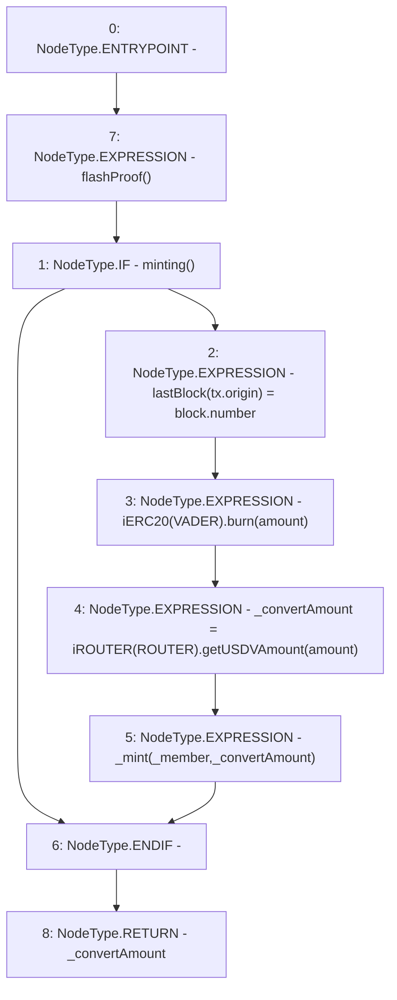

# Context: USDV._convert

**Contract:** `USDV` (Inherits: iERC20)
**Signature:** `_convert(address,uint256) returns (uint256)`
**Method Selector ID:** `Internal (No Method ID)`
**Visibility:** `internal`
**Environment-Free:** `No (reads EVM state context)`
**Modifiers:**
- `flashProof`
  ```solidity
  modifier flashProof() {
          require(isMature(), "No flash");
          _;
      }
  ```

### State Variables Interaction
- **Reads:** ROUTER, VADER
- **Writes:** lastBlock

### Environment & Verification Flags
- **Uses Foundry Cheatcodes:** No
- **Has Echidna Properties:** No

### Internal Calls Tree
- None

### External Calls / Value Transfers
- `iROUTER.TMP_813(uint256) = HIGH_LEVEL_CALL, dest:TMP_812(iROUTER), function:getUSDVAmount, arguments:['amount']  `
- `iERC20.HIGH_LEVEL_CALL, dest:TMP_810(iERC20), function:burn, arguments:['amount']  `

### Control Flow Graph (CFG)


### Source Mapping
Declared in: `contracts/USDV.sol` on lines **174** to **181**

```solidity
    function _convert(address _member, uint amount) internal flashProof returns(uint _convertAmount){
        if(minting()){
            lastBlock[tx.origin] = block.number;                    // Record first
            iERC20(VADER).burn(amount);
            _convertAmount = iROUTER(ROUTER).getUSDVAmount(amount); // Critical pricing functionality
            _mint(_member, _convertAmount);
        }
    }

```
