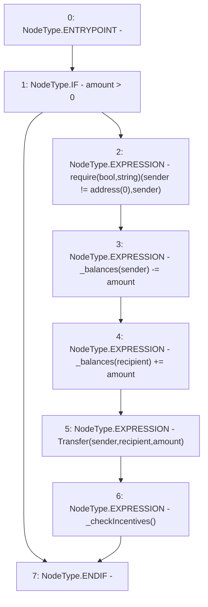

# Context: USDV._transfer

**Contract:** `USDV` (Inherits: iERC20)
**Signature:** `_transfer(address,address,uint256)`
**Method Selector ID:** `Internal (No Method ID)`
**Visibility:** `internal`
**Environment-Free:** `No (reads EVM state context)`
**Modifiers:** None

### State Variables Interaction
- **Reads:** _balances
- **Writes:** _balances

### Assertion Checks & Business Requirements
- require/assert: `require(bool,string)(sender != address(0),sender)`

### Environment & Verification Flags
- **Uses Foundry Cheatcodes:** No
- **Has Echidna Properties:** No

### Internal Calls Tree
- None

### External Calls / Value Transfers
- `TMP_749(None) = SOLIDITY_CALL require(bool,string)(TMP_748,sender)`

### Control Flow Graph (CFG)


### Source Mapping
Declared in: `contracts/USDV.sol` on lines **102** to **110**

```solidity
    function _transfer(address sender, address recipient, uint amount) internal virtual {
        if(amount > 0){                                     // Due to design, this function may be called with 0
            require(sender != address(0), "sender");
            _balances[sender] -= amount;
            _balances[recipient] += amount;
            emit Transfer(sender, recipient, amount);
            _checkIncentives();
        }
    }

```
