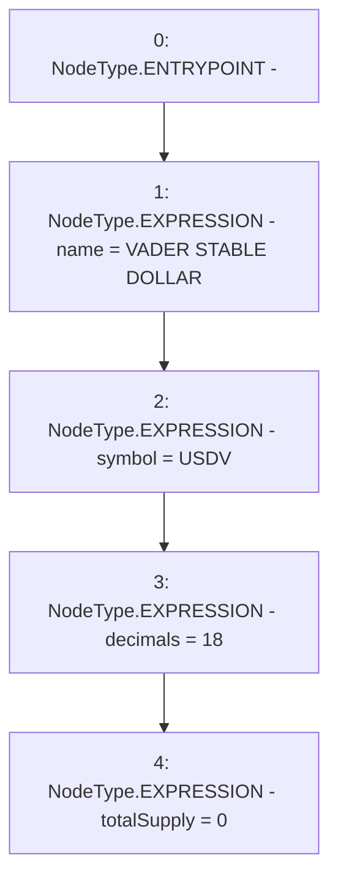

# Context: USDV.constructor

**Contract:** `USDV` (Inherits: iERC20)
**Signature:** `constructor()`
**Method Selector ID:** `0x90fa17bb`
**Visibility:** `public`
**Environment-Free:** `Yes`
**Modifiers:** None

### State Variables Interaction
- **Reads:** None
- **Writes:** decimals, name, symbol, totalSupply

### Environment & Verification Flags
- **Uses Foundry Cheatcodes:** No
- **Has Echidna Properties:** No

### Internal Calls Tree
- None

### External Calls / Value Transfers
- None

### Control Flow Graph (CFG)


### Source Mapping
Declared in: `contracts/USDV.sol` on lines **48** to **53**

```solidity
    constructor() {
        name = 'VADER STABLE DOLLAR';
        symbol = 'USDV';
        decimals = 18;
        totalSupply = 0;
    }

```
