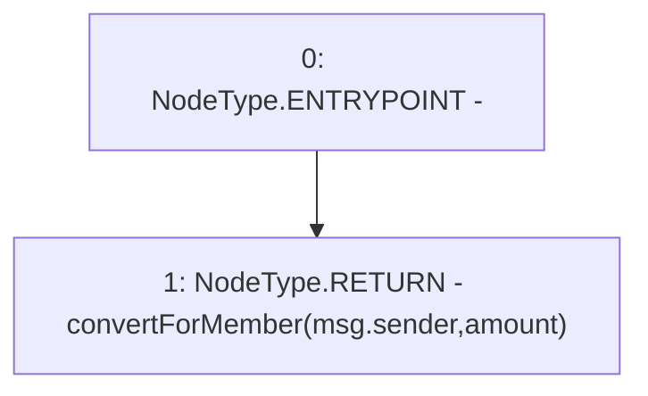

# Context: USDV.convert

**Contract:** `USDV` (Inherits: iERC20)
**Signature:** `convert(uint256) returns (uint256)`
**Method Selector ID:** `0xa3908e1b`
**Visibility:** `external`
**Environment-Free:** `No (reads EVM state context)`
**Modifiers:** None

### State Variables Interaction
- **Reads:** None
- **Writes:** None

### Environment & Verification Flags
- **Uses Foundry Cheatcodes:** No
- **Has Echidna Properties:** No

### Internal Calls Tree
- None

### External Calls / Value Transfers
- None

### Control Flow Graph (CFG)


### Source Mapping
Declared in: `contracts/USDV.sol` on lines **165** to **167**

```solidity
    function convert(uint amount) external returns(uint) {
        return convertForMember(msg.sender, amount);
    }

```
