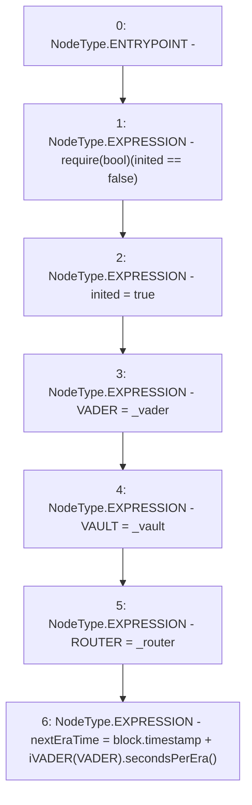

# Context: USDV.init

**Contract:** `USDV` (Inherits: iERC20)
**Signature:** `init(address,address,address)`
**Method Selector ID:** `0x184b9559`
**Visibility:** `external`
**Environment-Free:** `No (reads EVM state context)`
**Modifiers:** None

### State Variables Interaction
- **Reads:** VADER, inited
- **Writes:** ROUTER, VADER, VAULT, inited, nextEraTime

### Assertion Checks & Business Requirements
- require/assert: `require(bool)(inited == false)`

### Environment & Verification Flags
- **Uses Foundry Cheatcodes:** No
- **Has Echidna Properties:** No

### Internal Calls Tree
- None

### External Calls / Value Transfers
- `iVADER.TMP_731(uint256) = HIGH_LEVEL_CALL, dest:TMP_730(iVADER), function:secondsPerEra, arguments:[]  `

### Control Flow Graph (CFG)


### Source Mapping
Declared in: `contracts/USDV.sol` on lines **54** to **61**

```solidity
    function init(address _vader, address _vault, address _router) external {
        require(inited == false);
        inited = true;
        VADER = _vader;
        VAULT = _vault;
        ROUTER = _router;
        nextEraTime = block.timestamp + iVADER(VADER).secondsPerEra();
    }

```
