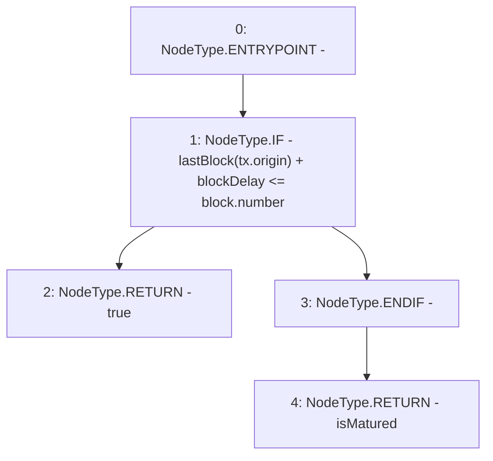

# Context: USDV.isMature

**Contract:** `USDV` (Inherits: iERC20)
**Signature:** `isMature() returns (bool)`
**Method Selector ID:** `0xae4e7fdf`
**Visibility:** `public`
**Environment-Free:** `No (reads EVM state context)`
**Modifiers:** None

### State Variables Interaction
- **Reads:** blockDelay, lastBlock
- **Writes:** None

### Environment & Verification Flags
- **Uses Foundry Cheatcodes:** No
- **Has Echidna Properties:** No

### Internal Calls Tree
- None

### External Calls / Value Transfers
- None

### Control Flow Graph (CFG)


### Source Mapping
Declared in: `contracts/USDV.sol` on lines **40** to **44**

```solidity
    function isMature() public view returns(bool isMatured){
        if(lastBlock[tx.origin] + blockDelay <= block.number){ // Stops an EOA doing a flash attack in same block
            return true;
        }
    }

```
