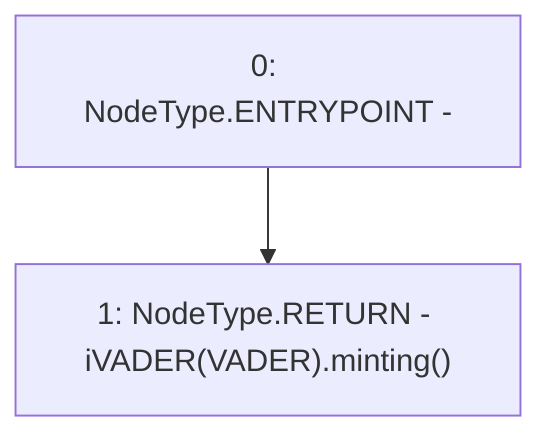

# Context: USDV.minting

**Contract:** `USDV` (Inherits: iERC20)
**Signature:** `minting() returns (bool)`
**Method Selector ID:** `0x7dc2268c`
**Visibility:** `public`
**Environment-Free:** `Yes`
**Modifiers:** None

### State Variables Interaction
- **Reads:** VADER
- **Writes:** None

### Environment & Verification Flags
- **Uses Foundry Cheatcodes:** No
- **Has Echidna Properties:** No

### Internal Calls Tree
- None

### External Calls / Value Transfers
- `iVADER.TMP_838(bool) = HIGH_LEVEL_CALL, dest:TMP_837(iVADER), function:minting, arguments:[]  `

### Control Flow Graph (CFG)


### Source Mapping
Declared in: `contracts/USDV.sol` on lines **215** to **217**

```solidity
    function minting() public view returns(bool){
        return iVADER(VADER).minting();
    }

```
