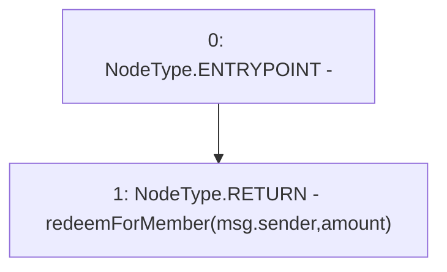

# Context: USDV.redeem

**Contract:** `USDV` (Inherits: iERC20)
**Signature:** `redeem(uint256) returns (uint256)`
**Method Selector ID:** `0xdb006a75`
**Visibility:** `external`
**Environment-Free:** `No (reads EVM state context)`
**Modifiers:** None

### State Variables Interaction
- **Reads:** None
- **Writes:** None

### Environment & Verification Flags
- **Uses Foundry Cheatcodes:** No
- **Has Echidna Properties:** No

### Internal Calls Tree
- None

### External Calls / Value Transfers
- None

### Control Flow Graph (CFG)


### Source Mapping
Declared in: `contracts/USDV.sol` on lines **183** to **185**

```solidity
    function redeem(uint amount) external returns(uint) {
        return redeemForMember(msg.sender, amount);
    }

```
