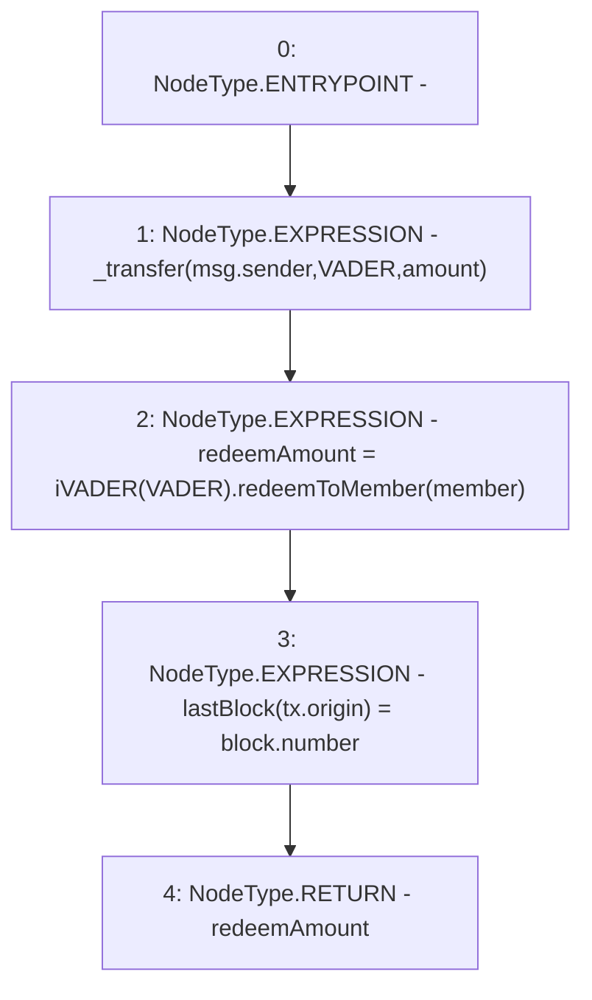

# Context: USDV.redeemForMember

**Contract:** `USDV` (Inherits: iERC20)
**Signature:** `redeemForMember(address,uint256) returns (uint256)`
**Method Selector ID:** `0xd2450e8f`
**Visibility:** `public`
**Environment-Free:** `No (reads EVM state context)`
**Modifiers:** None

### State Variables Interaction
- **Reads:** VADER
- **Writes:** lastBlock

### Environment & Verification Flags
- **Uses Foundry Cheatcodes:** No
- **Has Echidna Properties:** No

### Internal Calls Tree
- None

### External Calls / Value Transfers
- `iVADER.TMP_819(uint256) = HIGH_LEVEL_CALL, dest:TMP_818(iVADER), function:redeemToMember, arguments:['member']  `

### Control Flow Graph (CFG)


### Source Mapping
Declared in: `contracts/USDV.sol` on lines **187** to **191**

```solidity
    function redeemForMember(address member, uint amount) public returns(uint redeemAmount) {
        _transfer(msg.sender, VADER, amount);                   // Move funds
        redeemAmount = iVADER(VADER).redeemToMember(member);    // Ask VADER to redeem
        lastBlock[tx.origin] = block.number;                    // Must record block AFTER the tx
    }

```
