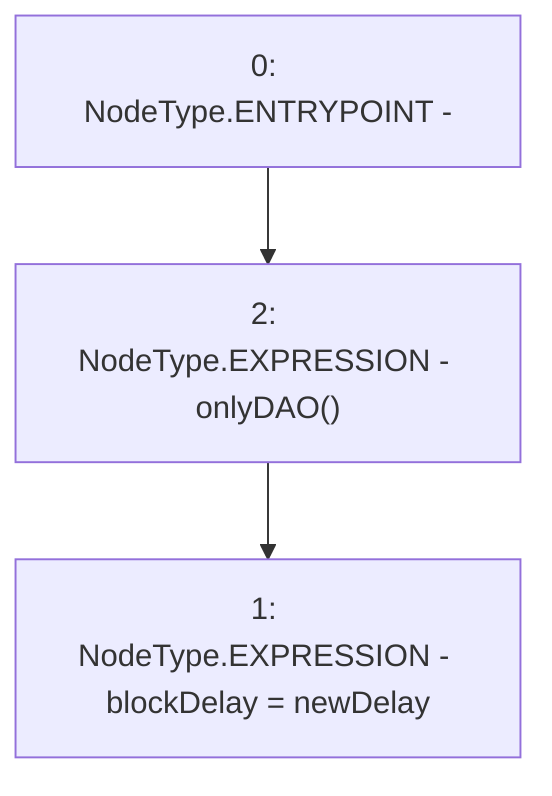

# Context: USDV.setParams

**Contract:** `USDV` (Inherits: iERC20)
**Signature:** `setParams(uint256)`
**Method Selector ID:** `0x59ded210`
**Visibility:** `external`
**Environment-Free:** `No (reads EVM state context)`
**Modifiers:**
- `onlyDAO`
  ```solidity
  modifier onlyDAO() {
          require(msg.sender == DAO(), "Not DAO");
          _;
      }
  ```

### State Variables Interaction
- **Reads:** None
- **Writes:** blockDelay

### Environment & Verification Flags
- **Uses Foundry Cheatcodes:** No
- **Has Echidna Properties:** No

### Internal Calls Tree
- None

### External Calls / Value Transfers
- None

### Control Flow Graph (CFG)


### Source Mapping
Declared in: `contracts/USDV.sol` on lines **140** to **142**

```solidity
    function setParams(uint newDelay) external onlyDAO {
        blockDelay = newDelay;
    }

```
