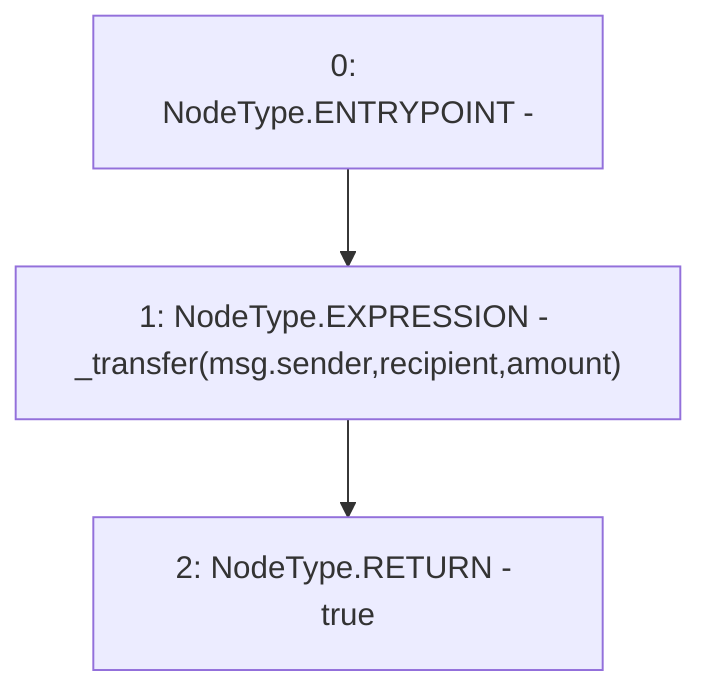

# Context: USDV.transfer

**Contract:** `USDV` (Inherits: iERC20)
**Signature:** `transfer(address,uint256) returns (bool)`
**Method Selector ID:** `0xa9059cbb`
**Visibility:** `external`
**Environment-Free:** `No (reads EVM state context)`
**Modifiers:** None

### State Variables Interaction
- **Reads:** None
- **Writes:** None

### Environment & Verification Flags
- **Uses Foundry Cheatcodes:** No
- **Has Echidna Properties:** No

### Internal Calls Tree
- None

### External Calls / Value Transfers
- None

### Control Flow Graph (CFG)


### Source Mapping
Declared in: `contracts/USDV.sol` on lines **71** to **74**

```solidity
    function transfer(address recipient, uint amount) external virtual override returns (bool) {
        _transfer(msg.sender, recipient, amount);
        return true;
    }

```
