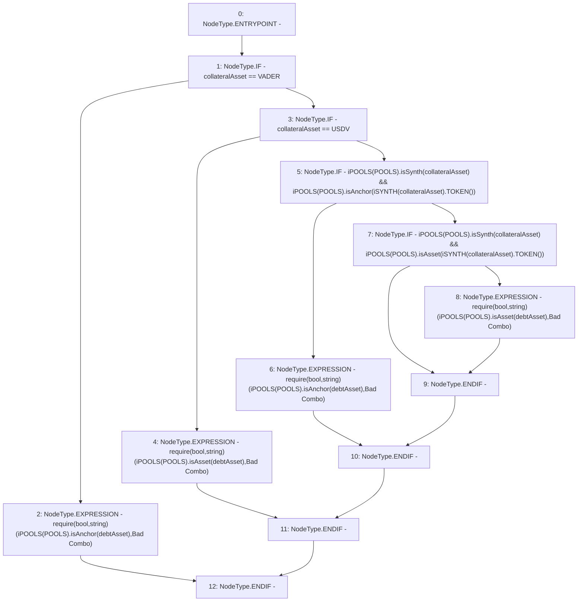

# Context: Utils.assetChecks

**Contract:** `Utils` (Inherits: None)
**Signature:** `assetChecks(address,address)`
**Method Selector ID:** `0xcf975e7b`
**Visibility:** `external`
**Environment-Free:** `Yes`
**Modifiers:** None

### State Variables Interaction
- **Reads:** POOLS, USDV, VADER
- **Writes:** None

### Assertion Checks & Business Requirements
- require/assert: `require(bool,string)(iPOOLS(POOLS).isAnchor(debtAsset),Bad Combo)`
- require/assert: `require(bool,string)(iPOOLS(POOLS).isAsset(debtAsset),Bad Combo)`
- require/assert: `require(bool,string)(iPOOLS(POOLS).isAnchor(debtAsset),Bad Combo)`
- require/assert: `require(bool,string)(iPOOLS(POOLS).isAsset(debtAsset),Bad Combo)`

### Environment & Verification Flags
- **Uses Foundry Cheatcodes:** No
- **Has Echidna Properties:** No

### Internal Calls Tree
- None

### External Calls / Value Transfers
- `iPOOLS.TMP_873(bool) = HIGH_LEVEL_CALL, dest:TMP_872(iPOOLS), function:isAsset, arguments:['debtAsset']  `
- `iPOOLS.TMP_856(bool) = HIGH_LEVEL_CALL, dest:TMP_855(iPOOLS), function:isSynth, arguments:['collateralAsset']  `
- `iPOOLS.TMP_866(bool) = HIGH_LEVEL_CALL, dest:TMP_865(iPOOLS), function:isSynth, arguments:['collateralAsset']  `
- `iPOOLS.TMP_853(bool) = HIGH_LEVEL_CALL, dest:TMP_852(iPOOLS), function:isAsset, arguments:['debtAsset']  `
- `iSYNTH.TMP_869(address) = HIGH_LEVEL_CALL, dest:TMP_868(iSYNTH), function:TOKEN, arguments:[]  `
- `iPOOLS.TMP_863(bool) = HIGH_LEVEL_CALL, dest:TMP_862(iPOOLS), function:isAnchor, arguments:['debtAsset']  `
- `iPOOLS.TMP_860(bool) = HIGH_LEVEL_CALL, dest:TMP_857(iPOOLS), function:isAnchor, arguments:['TMP_859']  `
- `iPOOLS.TMP_849(bool) = HIGH_LEVEL_CALL, dest:TMP_848(iPOOLS), function:isAnchor, arguments:['debtAsset']  `
- `iSYNTH.TMP_859(address) = HIGH_LEVEL_CALL, dest:TMP_858(iSYNTH), function:TOKEN, arguments:[]  `
- `iPOOLS.TMP_870(bool) = HIGH_LEVEL_CALL, dest:TMP_867(iPOOLS), function:isAsset, arguments:['TMP_869']  `

### Control Flow Graph (CFG)


### Source Mapping
Declared in: `contracts/Utils.sol` on lines **45** to **55**

```solidity
    function assetChecks(address collateralAsset, address debtAsset) external {
        if(collateralAsset == VADER){
            require(iPOOLS(POOLS).isAnchor(debtAsset), "Bad Combo"); // Can borrow Anchor with VADER/ANCHOR-SYNTH
        } else if(collateralAsset == USDV){
            require(iPOOLS(POOLS).isAsset(debtAsset), "Bad Combo"); // Can borrow Asset with VADER/ASSET-SYNTH
        } else if(iPOOLS(POOLS).isSynth(collateralAsset) && iPOOLS(POOLS).isAnchor(iSYNTH(collateralAsset).TOKEN())){
            require(iPOOLS(POOLS).isAnchor(debtAsset), "Bad Combo"); // Can borrow Anchor with VADER/ANCHOR-SYNTH
        } else if(iPOOLS(POOLS).isSynth(collateralAsset) && iPOOLS(POOLS).isAsset(iSYNTH(collateralAsset).TOKEN())){
            require(iPOOLS(POOLS).isAsset(debtAsset), "Bad Combo"); // Can borrow Anchor with VADER/ANCHOR-SYNTH
        }
    }

```
