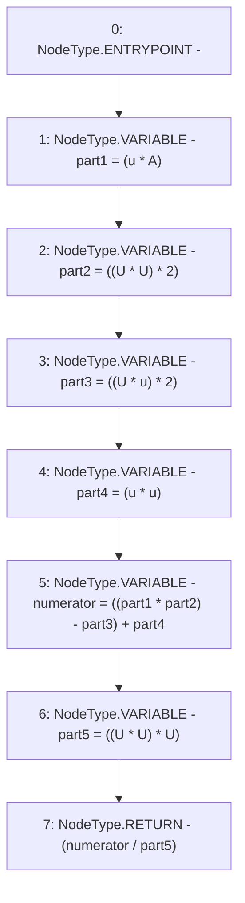

# Context: Utils.calcAsymmetricShare

**Contract:** `Utils` (Inherits: None)
**Signature:** `calcAsymmetricShare(uint256,uint256,uint256) returns (uint256)`
**Method Selector ID:** `0x4a127651`
**Visibility:** `public`
**Environment-Free:** `Yes`
**Modifiers:** None

### State Variables Interaction
- **Reads:** None
- **Writes:** None

### Environment & Verification Flags
- **Uses Foundry Cheatcodes:** No
- **Has Echidna Properties:** No

### Internal Calls Tree
- None

### External Calls / Value Transfers
- None

### Control Flow Graph (CFG)


### Source Mapping
Declared in: `contracts/Utils.sol` on lines **266** to **276**

```solidity
    function calcAsymmetricShare(uint u, uint U, uint A) public pure returns (uint){
        // share = (u * U * (2 * A^2 - 2 * U * u + U^2))/U^3
        // (part1 * (part2 - part3 + part4)) / part5
        uint part1 = (u * A);
        uint part2 = ((U * U) * 2);
        uint part3 = ((U * u) * 2);
        uint part4 = (u * u);
        uint numerator = ((part1 * part2) - part3) + part4;
        uint part5 = ((U * U) * U);
        return (numerator / part5);
    }

```
