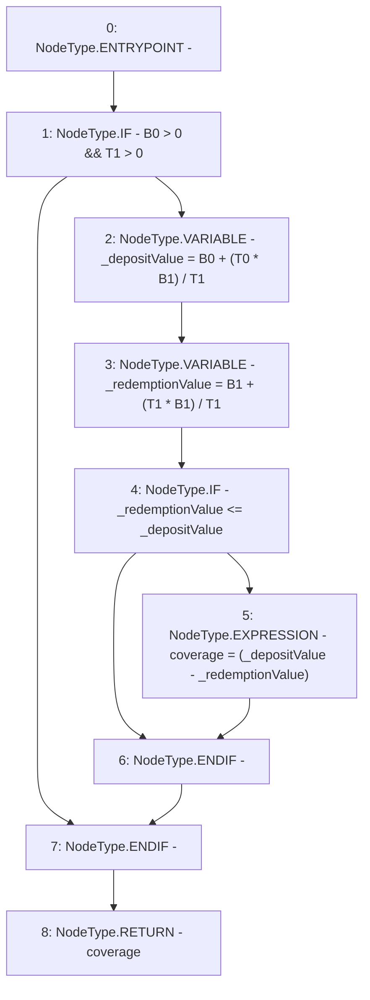

# Context: Utils.calcCoverage

**Contract:** `Utils` (Inherits: None)
**Signature:** `calcCoverage(uint256,uint256,uint256,uint256) returns (uint256)`
**Method Selector ID:** `0x595a88a7`
**Visibility:** `public`
**Environment-Free:** `Yes`
**Modifiers:** None

### State Variables Interaction
- **Reads:** None
- **Writes:** None

### Environment & Verification Flags
- **Uses Foundry Cheatcodes:** No
- **Has Echidna Properties:** No

### Internal Calls Tree
- None

### External Calls / Value Transfers
- None

### Control Flow Graph (CFG)


### Source Mapping
Declared in: `contracts/Utils.sol` on lines **277** to **285**

```solidity
    function calcCoverage(uint B0, uint T0, uint B1, uint T1) public pure returns(uint coverage){
        if(B0 > 0 && T1 > 0){
            uint _depositValue = B0 + (T0 * B1) / T1; // B0+(T0*B1/T1)
            uint _redemptionValue = B1 + (T1 * B1) / T1; // B1+(T1*B1/T1)
            if(_redemptionValue <= _depositValue){
                coverage = (_depositValue - _redemptionValue);
            }
        }
    }

```
