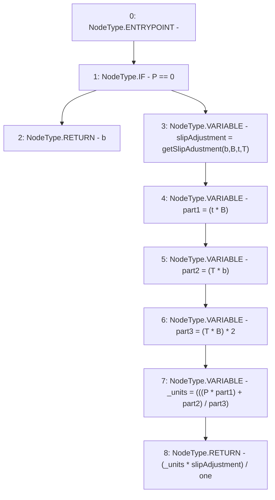

# Context: Utils.calcLiquidityUnits

**Contract:** `Utils` (Inherits: None)
**Signature:** `calcLiquidityUnits(uint256,uint256,uint256,uint256,uint256) returns (uint256)`
**Method Selector ID:** `0xc5c11ee9`
**Visibility:** `external`
**Environment-Free:** `Yes`
**Modifiers:** None

### State Variables Interaction
- **Reads:** one
- **Writes:** None

### Environment & Verification Flags
- **Uses Foundry Cheatcodes:** No
- **Has Echidna Properties:** No

### Internal Calls Tree
- None

### External Calls / Value Transfers
- None

### Control Flow Graph (CFG)


### Source Mapping
Declared in: `contracts/Utils.sol` on lines **229** to **242**

```solidity
    function calcLiquidityUnits(uint b, uint B, uint t, uint T, uint P) external view returns (uint){
        if(P == 0){
            return b;
        } else {
            // units = ((P (t B + T b))/(2 T B)) * slipAdjustment
            // P * (part1 + part2) / (part3) * slipAdjustment
            uint slipAdjustment = getSlipAdustment(b, B, t, T);
            uint part1 = (t * B);
            uint part2 = (T * b);
            uint part3 = (T * B) * 2;
            uint _units = (((P * part1) + part2) / part3);
            return (_units * slipAdjustment) / one;  // Divide by 10**18
        }
    }

```
