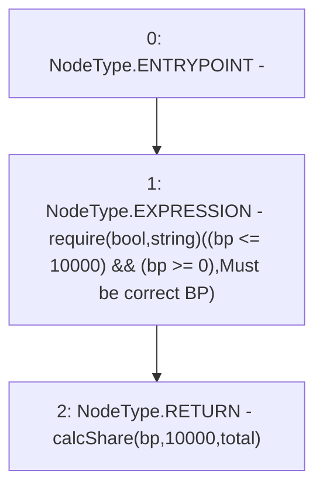

# Context: Utils.calcPart

**Contract:** `Utils` (Inherits: None)
**Signature:** `calcPart(uint256,uint256) returns (uint256)`
**Method Selector ID:** `0x714270ab`
**Visibility:** `public`
**Environment-Free:** `Yes`
**Modifiers:** None

### State Variables Interaction
- **Reads:** None
- **Writes:** None

### Assertion Checks & Business Requirements
- require/assert: `require(bool,string)((bp <= 10000) && (bp >= 0),Must be correct BP)`

### Environment & Verification Flags
- **Uses Foundry Cheatcodes:** No
- **Has Echidna Properties:** No

### Internal Calls Tree
- None

### External Calls / Value Transfers
- None

### Control Flow Graph (CFG)


### Source Mapping
Declared in: `contracts/Utils.sol` on lines **195** to **199**

```solidity
    function calcPart(uint bp, uint total) public pure returns (uint){
        // 10,000 basis points = 100.00%
        require((bp <= 10000) && (bp >= 0), "Must be correct BP");
        return calcShare(bp, 10000, total);
    }

```
