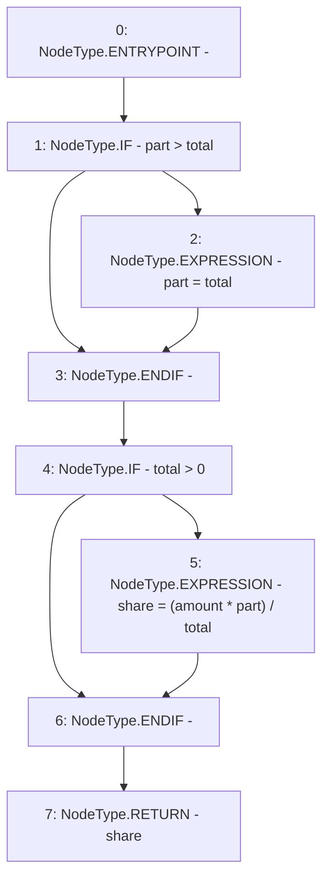

# Context: Utils.calcShare

**Contract:** `Utils` (Inherits: None)
**Signature:** `calcShare(uint256,uint256,uint256) returns (uint256)`
**Method Selector ID:** `0x1ba326c4`
**Visibility:** `public`
**Environment-Free:** `Yes`
**Modifiers:** None

### State Variables Interaction
- **Reads:** None
- **Writes:** None

### Environment & Verification Flags
- **Uses Foundry Cheatcodes:** No
- **Has Echidna Properties:** No

### Internal Calls Tree
- None

### External Calls / Value Transfers
- None

### Control Flow Graph (CFG)


### Source Mapping
Declared in: `contracts/Utils.sol` on lines **201** to **209**

```solidity
    function calcShare(uint part, uint total, uint amount) public pure returns (uint share){
        // share = amount * part/total
        if(part > total){
            part = total;
        }
        if(total > 0){
            share = (amount * part) / total;
        }
    }

```
