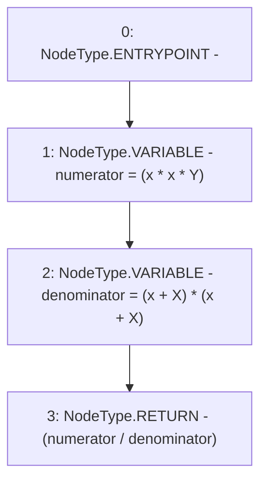

# Context: Utils.calcSwapFee

**Contract:** `Utils` (Inherits: None)
**Signature:** `calcSwapFee(uint256,uint256,uint256) returns (uint256)`
**Method Selector ID:** `0x896a708c`
**Visibility:** `external`
**Environment-Free:** `Yes`
**Modifiers:** None

### State Variables Interaction
- **Reads:** None
- **Writes:** None

### Environment & Verification Flags
- **Uses Foundry Cheatcodes:** No
- **Has Echidna Properties:** No

### Internal Calls Tree
- None

### External Calls / Value Transfers
- None

### Control Flow Graph (CFG)


### Source Mapping
Declared in: `contracts/Utils.sol` on lines **218** to **223**

```solidity
    function calcSwapFee(uint x, uint X, uint Y) external pure returns (uint){
        // fee = (x * x * Y) / (x + X)^2
        uint numerator = (x * x * Y);
        uint denominator = (x + X) * (x + X);
        return (numerator / denominator);
    }

```
