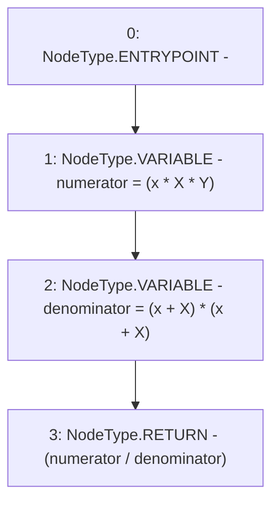

# Context: Utils.calcSwapOutput

**Contract:** `Utils` (Inherits: None)
**Signature:** `calcSwapOutput(uint256,uint256,uint256) returns (uint256)`
**Method Selector ID:** `0x701baaf3`
**Visibility:** `public`
**Environment-Free:** `Yes`
**Modifiers:** None

### State Variables Interaction
- **Reads:** None
- **Writes:** None

### Environment & Verification Flags
- **Uses Foundry Cheatcodes:** No
- **Has Echidna Properties:** No

### Internal Calls Tree
- None

### External Calls / Value Transfers
- None

### Control Flow Graph (CFG)


### Source Mapping
Declared in: `contracts/Utils.sol` on lines **211** to **216**

```solidity
    function calcSwapOutput(uint x, uint X, uint Y) public pure returns (uint){
        // y = (x * X * Y )/(x + X)^2
        uint numerator = (x * X * Y);
        uint denominator = (x + X) * (x + X);
        return (numerator / denominator);
    }

```
