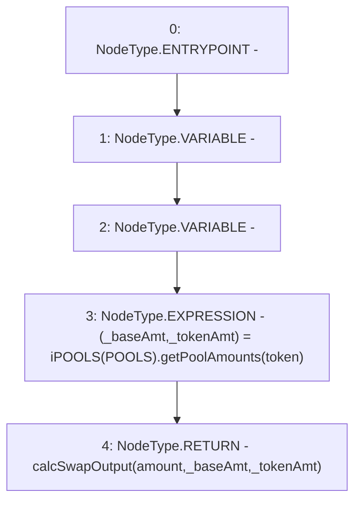

# Context: Utils.calcSwapValueInToken

**Contract:** `Utils` (Inherits: None)
**Signature:** `calcSwapValueInToken(address,uint256) returns (uint256)`
**Method Selector ID:** `0x5f2c12e8`
**Visibility:** `public`
**Environment-Free:** `Yes`
**Modifiers:** None

### State Variables Interaction
- **Reads:** POOLS
- **Writes:** None

### Environment & Verification Flags
- **Uses Foundry Cheatcodes:** No
- **Has Echidna Properties:** No

### Internal Calls Tree
- None

### External Calls / Value Transfers
- `iPOOLS.TUPLE_8(uint256,uint256) = HIGH_LEVEL_CALL, dest:TMP_899(iPOOLS), function:getPoolAmounts, arguments:['token']  `

### Control Flow Graph (CFG)


### Source Mapping
Declared in: `contracts/Utils.sol` on lines **91** to **94**

```solidity
    function calcSwapValueInToken(address token, uint amount) public view returns (uint){
        (uint _baseAmt, uint _tokenAmt) = iPOOLS(POOLS).getPoolAmounts(token);
        return calcSwapOutput(amount, _baseAmt, _tokenAmt);
    }

```
