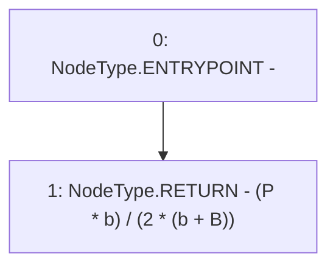

# Context: Utils.calcSynthUnits

**Contract:** `Utils` (Inherits: None)
**Signature:** `calcSynthUnits(uint256,uint256,uint256) returns (uint256)`
**Method Selector ID:** `0xec1753f1`
**Visibility:** `external`
**Environment-Free:** `Yes`
**Modifiers:** None

### State Variables Interaction
- **Reads:** None
- **Writes:** None

### Environment & Verification Flags
- **Uses Foundry Cheatcodes:** No
- **Has Echidna Properties:** No

### Internal Calls Tree
- None

### External Calls / Value Transfers
- None

### Control Flow Graph (CFG)


### Source Mapping
Declared in: `contracts/Utils.sol` on lines **261** to **264**

```solidity
    function calcSynthUnits(uint b, uint B, uint P) external pure returns(uint){
        // (P * b)/(2*(b + B))
        return (P * b) / (2 * (b + B));
    }

```
