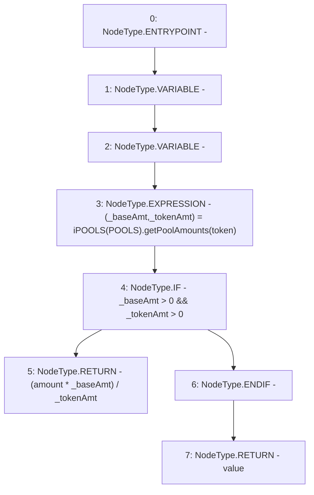

# Context: Utils.calcValueInBase

**Contract:** `Utils` (Inherits: None)
**Signature:** `calcValueInBase(address,uint256) returns (uint256)`
**Method Selector ID:** `0xdb39dc79`
**Visibility:** `public`
**Environment-Free:** `Yes`
**Modifiers:** None

### State Variables Interaction
- **Reads:** POOLS
- **Writes:** None

### Environment & Verification Flags
- **Uses Foundry Cheatcodes:** No
- **Has Echidna Properties:** No

### Internal Calls Tree
- None

### External Calls / Value Transfers
- `iPOOLS.TUPLE_5(uint256,uint256) = HIGH_LEVEL_CALL, dest:TMP_883(iPOOLS), function:getPoolAmounts, arguments:['token']  `

### Control Flow Graph (CFG)


### Source Mapping
Declared in: `contracts/Utils.sol` on lines **70** to **75**

```solidity
    function calcValueInBase(address token, uint amount) public view returns (uint value){
       (uint _baseAmt, uint _tokenAmt) = iPOOLS(POOLS).getPoolAmounts(token);
       if(_baseAmt > 0 && _tokenAmt > 0){
            return (amount * _baseAmt) / _tokenAmt;
       }
    }

```
