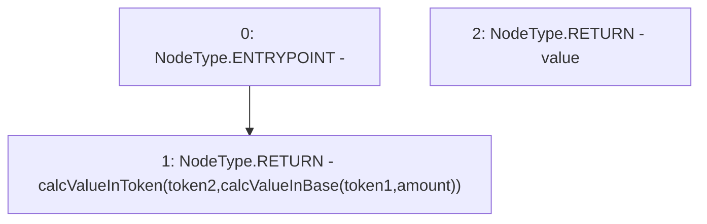

# Context: Utils.calcValueOfTokenInToken

**Contract:** `Utils` (Inherits: None)
**Signature:** `calcValueOfTokenInToken(address,uint256,address) returns (uint256)`
**Method Selector ID:** `0xdcf3f1e0`
**Visibility:** `public`
**Environment-Free:** `Yes`
**Modifiers:** None

### State Variables Interaction
- **Reads:** None
- **Writes:** None

### Environment & Verification Flags
- **Uses Foundry Cheatcodes:** No
- **Has Echidna Properties:** No

### Internal Calls Tree
- None

### External Calls / Value Transfers
- None

### Control Flow Graph (CFG)


### Source Mapping
Declared in: `contracts/Utils.sol` on lines **83** to **85**

```solidity
    function calcValueOfTokenInToken(address token1, uint amount, address token2) public view returns (uint value){
            return calcValueInToken(token2, calcValueInBase(token1, amount));
    }

```
