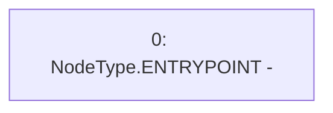

# Context: Utils.constructor

**Contract:** `Utils` (Inherits: None)
**Signature:** `constructor()`
**Method Selector ID:** `0x90fa17bb`
**Visibility:** `public`
**Environment-Free:** `Yes`
**Modifiers:** None

### State Variables Interaction
- **Reads:** None
- **Writes:** None

### Environment & Verification Flags
- **Uses Foundry Cheatcodes:** No
- **Has Echidna Properties:** No

### Internal Calls Tree
- None

### External Calls / Value Transfers
- None

### Control Flow Graph (CFG)


### Source Mapping
Declared in: `contracts/Utils.sol` on lines **28** to **28**

```solidity
    constructor () {}

```
