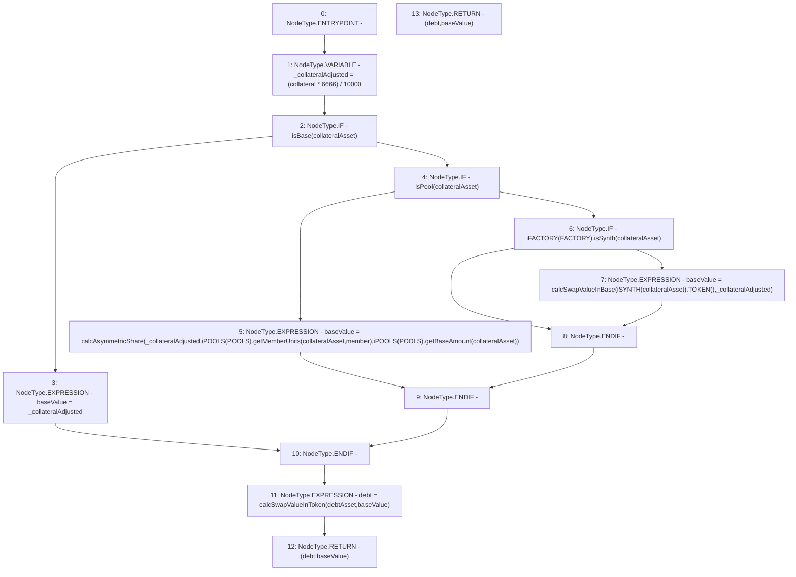

# Context: Utils.getCollateralValueInBase

**Contract:** `Utils` (Inherits: None)
**Signature:** `getCollateralValueInBase(address,uint256,address,address) returns (uint256, uint256)`
**Method Selector ID:** `0x5c22141f`
**Visibility:** `external`
**Environment-Free:** `Yes`
**Modifiers:** None

### State Variables Interaction
- **Reads:** FACTORY, POOLS
- **Writes:** None

### Environment & Verification Flags
- **Uses Foundry Cheatcodes:** No
- **Has Echidna Properties:** No

### Internal Calls Tree
- None

### External Calls / Value Transfers
- `iFACTORY.TMP_975(bool) = HIGH_LEVEL_CALL, dest:TMP_974(iFACTORY), function:isSynth, arguments:['collateralAsset']  `
- `iPOOLS.TMP_970(uint256) = HIGH_LEVEL_CALL, dest:TMP_969(iPOOLS), function:getMemberUnits, arguments:['collateralAsset', 'member']  `
- `iSYNTH.TMP_977(address) = HIGH_LEVEL_CALL, dest:TMP_976(iSYNTH), function:TOKEN, arguments:[]  `
- `iPOOLS.TMP_972(uint256) = HIGH_LEVEL_CALL, dest:TMP_971(iPOOLS), function:getBaseAmount, arguments:['collateralAsset']  `

### Control Flow Graph (CFG)


### Source Mapping
Declared in: `contracts/Utils.sol` on lines **152** to **163**

```solidity
    function getCollateralValueInBase(address member, uint collateral, address collateralAsset, address debtAsset) external view returns (uint debt, uint baseValue) {
        uint _collateralAdjusted = (collateral * 6666) / 10000; // 150% collateral Ratio
        if(isBase(collateralAsset)){
            baseValue = _collateralAdjusted;
        }else if(isPool(collateralAsset)){
            baseValue = calcAsymmetricShare(_collateralAdjusted, iPOOLS(POOLS).getMemberUnits(collateralAsset, member), iPOOLS(POOLS).getBaseAmount(collateralAsset)); // calc units to BASE
        }else if(iFACTORY(FACTORY).isSynth(collateralAsset)){
            baseValue = calcSwapValueInBase(iSYNTH(collateralAsset).TOKEN(), _collateralAdjusted); // Calc swap value
        }
        debt = calcSwapValueInToken(debtAsset, baseValue);        // get debt output
        return (debt, baseValue);
    }

```
