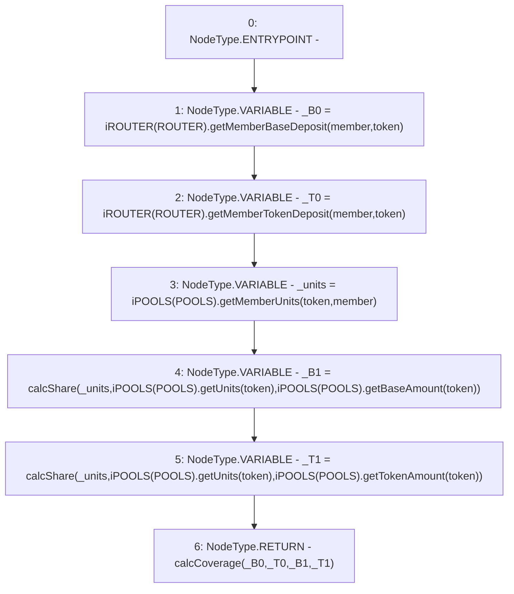

# Context: Utils.getCoverage

**Contract:** `Utils` (Inherits: None)
**Signature:** `getCoverage(address,address) returns (uint256)`
**Method Selector ID:** `0x12a86ffb`
**Visibility:** `public`
**Environment-Free:** `Yes`
**Modifiers:** None

### State Variables Interaction
- **Reads:** POOLS, ROUTER
- **Writes:** None

### Environment & Verification Flags
- **Uses Foundry Cheatcodes:** No
- **Has Echidna Properties:** No

### Internal Calls Tree
- None

### External Calls / Value Transfers
- `iPOOLS.TMP_962(uint256) = HIGH_LEVEL_CALL, dest:TMP_961(iPOOLS), function:getTokenAmount, arguments:['token']  `
- `iPOOLS.TMP_953(uint256) = HIGH_LEVEL_CALL, dest:TMP_952(iPOOLS), function:getMemberUnits, arguments:['token', 'member']  `
- `iROUTER.TMP_951(uint256) = HIGH_LEVEL_CALL, dest:TMP_950(iROUTER), function:getMemberTokenDeposit, arguments:['member', 'token']  `
- `iPOOLS.TMP_960(uint256) = HIGH_LEVEL_CALL, dest:TMP_959(iPOOLS), function:getUnits, arguments:['token']  `
- `iROUTER.TMP_949(uint256) = HIGH_LEVEL_CALL, dest:TMP_948(iROUTER), function:getMemberBaseDeposit, arguments:['member', 'token']  `
- `iPOOLS.TMP_955(uint256) = HIGH_LEVEL_CALL, dest:TMP_954(iPOOLS), function:getUnits, arguments:['token']  `
- `iPOOLS.TMP_957(uint256) = HIGH_LEVEL_CALL, dest:TMP_956(iPOOLS), function:getBaseAmount, arguments:['token']  `

### Control Flow Graph (CFG)


### Source Mapping
Declared in: `contracts/Utils.sol` on lines **142** to **148**

```solidity
    function getCoverage(address member, address token) public view returns (uint) {
        uint _B0 = iROUTER(ROUTER).getMemberBaseDeposit(member, token); uint _T0 = iROUTER(ROUTER).getMemberTokenDeposit(member, token);
        uint _units = iPOOLS(POOLS).getMemberUnits(token, member);
        uint _B1 = calcShare(_units, iPOOLS(POOLS).getUnits(token), iPOOLS(POOLS).getBaseAmount(token));
        uint _T1 = calcShare(_units, iPOOLS(POOLS).getUnits(token), iPOOLS(POOLS).getTokenAmount(token));
        return calcCoverage(_B0, _T0, _B1, _T1);
    }

```
