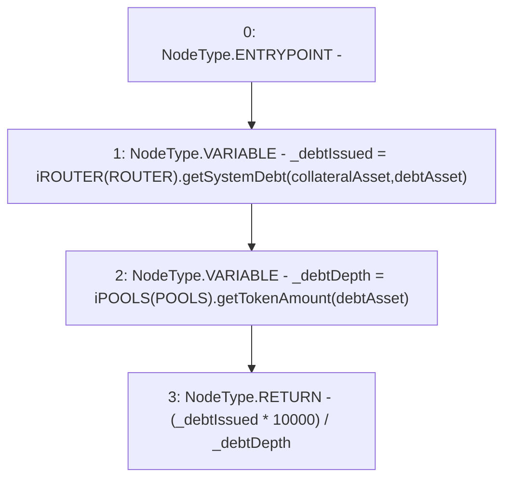

# Context: Utils.getDebtLoading

**Contract:** `Utils` (Inherits: None)
**Signature:** `getDebtLoading(address,address) returns (uint256)`
**Method Selector ID:** `0x9e3f1e8e`
**Visibility:** `public`
**Environment-Free:** `Yes`
**Modifiers:** None

### State Variables Interaction
- **Reads:** POOLS, ROUTER
- **Writes:** None

### Environment & Verification Flags
- **Uses Foundry Cheatcodes:** No
- **Has Echidna Properties:** No

### Internal Calls Tree
- None

### External Calls / Value Transfers
- `iROUTER.TMP_1003(uint256) = HIGH_LEVEL_CALL, dest:TMP_1002(iROUTER), function:getSystemDebt, arguments:['collateralAsset', 'debtAsset']  `
- `iPOOLS.TMP_1005(uint256) = HIGH_LEVEL_CALL, dest:TMP_1004(iPOOLS), function:getTokenAmount, arguments:['debtAsset']  `

### Control Flow Graph (CFG)


### Source Mapping
Declared in: `contracts/Utils.sol` on lines **187** to **191**

```solidity
    function getDebtLoading(address collateralAsset, address debtAsset) public view returns(uint) {
        uint _debtIssued = iROUTER(ROUTER).getSystemDebt(collateralAsset, debtAsset);
        uint _debtDepth = iPOOLS(POOLS).getTokenAmount(debtAsset);
        return (_debtIssued * 10000) / _debtDepth; 
    }

```
