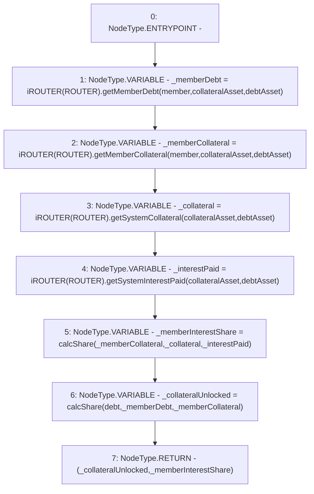

# Context: Utils.getDebtValueInCollateral

**Contract:** `Utils` (Inherits: None)
**Signature:** `getDebtValueInCollateral(address,uint256,address,address) returns (uint256, uint256)`
**Method Selector ID:** `0xd549a1ec`
**Visibility:** `external`
**Environment-Free:** `Yes`
**Modifiers:** None

### State Variables Interaction
- **Reads:** ROUTER
- **Writes:** None

### Environment & Verification Flags
- **Uses Foundry Cheatcodes:** No
- **Has Echidna Properties:** No

### Internal Calls Tree
- None

### External Calls / Value Transfers
- `iROUTER.TMP_985(uint256) = HIGH_LEVEL_CALL, dest:TMP_984(iROUTER), function:getSystemCollateral, arguments:['collateralAsset', 'debtAsset']  `
- `iROUTER.TMP_983(uint256) = HIGH_LEVEL_CALL, dest:TMP_982(iROUTER), function:getMemberCollateral, arguments:['member', 'collateralAsset', 'debtAsset']  `
- `iROUTER.TMP_987(uint256) = HIGH_LEVEL_CALL, dest:TMP_986(iROUTER), function:getSystemInterestPaid, arguments:['collateralAsset', 'debtAsset']  `
- `iROUTER.TMP_981(uint256) = HIGH_LEVEL_CALL, dest:TMP_980(iROUTER), function:getMemberDebt, arguments:['member', 'collateralAsset', 'debtAsset']  `

### Control Flow Graph (CFG)


### Source Mapping
Declared in: `contracts/Utils.sol` on lines **165** to **173**

```solidity
    function getDebtValueInCollateral(address member, uint debt, address collateralAsset, address debtAsset) external view returns(uint, uint) {
        uint _memberDebt = iROUTER(ROUTER).getMemberDebt(member, collateralAsset, debtAsset); // Outstanding Debt
        uint _memberCollateral = iROUTER(ROUTER).getMemberCollateral(member, collateralAsset, debtAsset); // Collateral
        uint _collateral = iROUTER(ROUTER).getSystemCollateral(collateralAsset, debtAsset);
        uint _interestPaid = iROUTER(ROUTER).getSystemInterestPaid(collateralAsset, debtAsset);
        uint _memberInterestShare = calcShare(_memberCollateral, _collateral, _interestPaid); // Share of interest based on collateral
        uint _collateralUnlocked = calcShare(debt, _memberDebt, _memberCollateral); 
        return (_collateralUnlocked, _memberInterestShare);
    }

```
